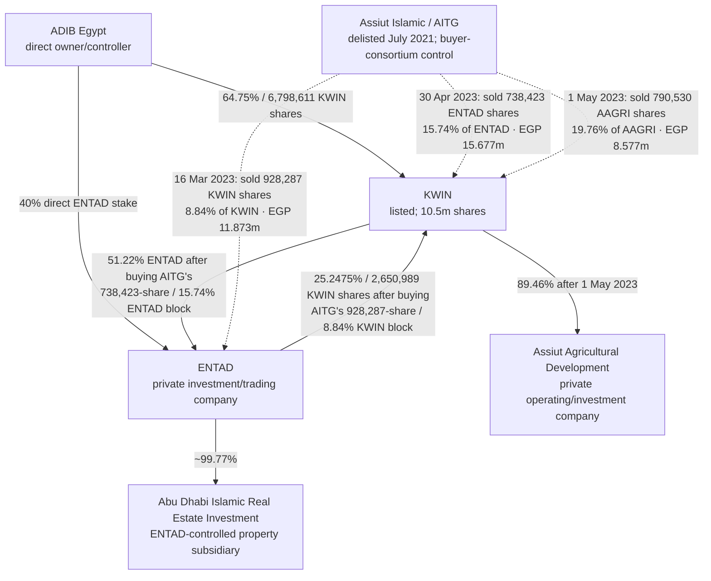
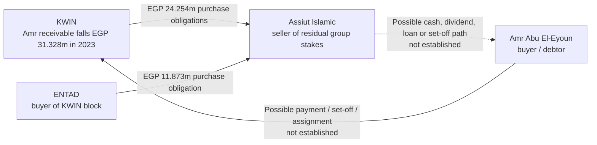
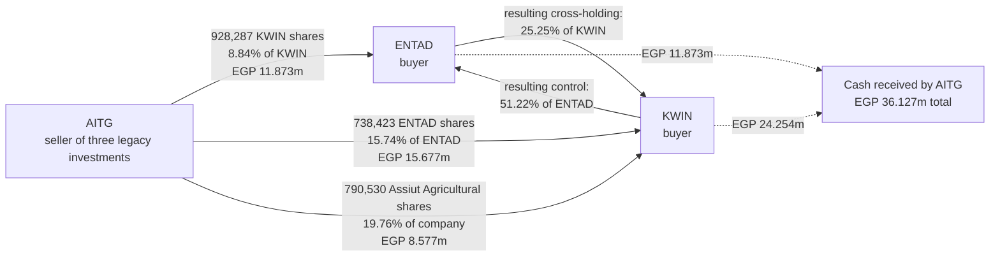

# KWIN–ENTAD–Assiut Equity-Network Dossier

Research cutoff: 25 July 2026  
Companies and people in scope: Cairo National for Investment and Securities (KWIN), the National Company for Trade and Development (ENTAD), Abu Dhabi Islamic Bank–Egypt (ADIB Egypt), Assiut Islamic National for Trade and Development (Assiut Islamic/AITG), Assiut Agricultural Development, Abu Dhabi Islamic Real Estate Investment, Amr Ibrahim Abu El‑Eyoun, and Dr Mohamed Ahmed Mohamed Shalaby.

## Purpose and evidentiary standard

This is a forensic reconstruction from public records. It is designed to preserve the complete chronology, the money and share arithmetic, the legal questions, the benign explanations, and the documents still needed to reach regulator-grade conclusions.

The dossier uses four evidence labels:

- **Confirmed fact:** stated in a primary filing, audited account, meeting minute, law, or regulator document.
- **Confirmed compliance event:** a regulator or exchange expressly recorded an objection, noncompliance, transfer restriction, or financial commitment.
- **Prima facie legal question:** the public facts appear to engage a rule, but the complete transaction file, an exemption, a regulator interpretation, or a private agreement may change the answer.
- **Suspicion/hypothesis:** the pattern is unusual and testable but is not proof of illegality, manipulation, fraud, or improper intent.

The central conclusion is not “this was proved to be a pump and dump.” The defensible conclusion is:

> The ADIB–KWIN–ENTAD network created a circular parent/subsidiary ownership structure, came within 400 shares of 90% group control of KWIN, abandoned a proposed take-private at EGP 10.50, and later monetized 945,911 subsidiary-held parent shares for about EGP 79.9 million during abnormal-liquidity episodes at a weighted price near EGP 84.50. Separately, the Assiut Islamic takeover was a properly approved cash tender on its face, but KWIN’s audited accounts show that 77.96% of KWIN’s EGP 44.50 million sale price remained a receivable from bidder Amr Abu El‑Eyoun at year-end 2021. FRA’s archived approval confirms that major-shareholder agreements existed before the offer. Those private agreements, the offer memorandum, and the settlement records are the missing evidence needed to determine whether the seller financing and the 2023 cross-company asset purchases were fully disclosed and independent.

> **25 July 2026 valuation erratum:** visual verification of the signed 2024 consolidated balance sheet and its 30 June 2025 comparative confirms 31 December 2024 parent-attributable equity of **EGP 71.266411m**, NCI of **EGP 10.110688m**, and total equity of **EGP 81.377099m**. The reconstructed EGP 37.37m/EGP 59.156m figures later in section 9.1 are incorrect and must not be used. The EGP 26.509890m treasury-share deduction remains confirmed. See [the dedicated look-through valuation](./kwin_group_lookthrough_valuation_2026-07-25.md).

There are already **three documented compliance/governance events**:

1. EGX moved delisted Assiut Islamic to the ownership-transfer system in August 2022 because the company had not obtained EGX’s no-objection for a capital reduction.
2. FRA’s representative formally objected to KWIN’s 31 December 2023 blanket related-party authorization under Listing Rule 39 and Companies Law Executive Regulation Article 217.
3. FRA’s certification of KWIN’s 31 March 2026 AGM expressly recorded noncompliance with Companies Law Article 41 and Executive Regulation Article 196 concerning profit distribution.

Those events establish that the sequence was not administratively flawless. They do **not**, alone or together, prove market manipulation or fraudulent extraction.

I am not telling you to invest. I am just sharing research insights. This is not legal advice.

## Executive findings matrix

| Finding | Public evidence | Classification | What it proves—and what it does not |
|---|---|---|---|
| Assiut takeover was a formal cash MTO at EGP 28.50 | FRA approval, offer reports, execution notice | Confirmed fact | It was not an unreported private transfer. It does not prove every side agreement was disclosed. |
| Independent Assiut value was EGP 22.35 | Offer reporting | Confirmed fact | The EGP 28.50 offer was a 27.5% premium, weakening a “cheap squeeze-out” theory. |
| ADIB-group sellers disposed of 66.65% of Assiut | ADIB 2021 accounts and offer arithmetic | Confirmed fact | The group received about EGP 126.98m and recorded about EGP 88m group gain. |
| KWIN sold its 23.358% Assiut stake for EGP 44.4999m | KWIN 2021 audited standalone accounts | Confirmed fact | KWIN recognized a large disposal gain versus its historical carrying amount. |
| EGP 34.692377m remained due from Amr Abu El‑Eyoun at 31 Dec 2021 | KWIN 2021 audited accounts | Confirmed fact | KWIN had received only 22.04% of its stated sale price by year-end. It does not show whether EGX cash settlement occurred and was followed by a separate loan or recycling arrangement. |
| KWIN accounts say payment followed “the agreement concluded between them” | KWIN 2021 note | Confirmed fact | A bilateral payment arrangement existed; its terms are not public. |
| FRA approval refers to major-shareholder agreements dated 26 Jan 2021 and a bidder undertaking dated 22 Feb 2021 | Recovered pages from archived FRA approval | Confirmed fact | Side agreements existed before the MTO. The public archive does not reveal their terms. |
| KWIN’s Amr receivable fell by EGP 31.327801m during 2023 | KWIN 2022 and 2023 audited accounts | Confirmed fact | Almost the whole receivable was extinguished in the same year as Assiut sold three residual group assets. It does not prove the asset-sale cash was used for that settlement. |
| Assiut received about EGP 36.126762m from the three residual stake sales | Block announcements and exact arithmetic | Confirmed fact | The amount is EGP 4.799m above the 2023 receivable reduction, making a circular set-off hypothesis numerically plausible but unproved. |
| KWIN and ENTAD became parent and controlled subsidiary while holding each other’s shares | 30 Apr 2023 control announcement and ownership forms | Confirmed fact | It created a circular cross-holding and a subsidiary-held parent position. |
| ADIB + ENTAD held exactly 9,449,600 KWIN shares, 89.99619% | 2024 audited ownership note | Confirmed fact | The group was only 400 shares below 90%. Intent to evade the 90% minority-petition threshold is not proved. |
| KWIN 17 Mar 2024 AGM attendance was exactly 9,449,600 | Official AGM minutes | Confirmed fact / prima facie legal question | The attendance equals the ADIB+ENTAD block exactly. If ENTAD’s parent shares were subject to treasury-share restrictions, they should not have counted for attendance, quorum, or voting. |
| 31 Dec 2023 attendance was ADIB+ENTAD plus one outside holder | Official AGM minutes | Confirmed fact / prima facie legal question | The same pattern appeared in a second post-control meeting. |
| FRA objected to the 31 Dec 2023 blanket related-party approval | FRA statement embedded in minutes | Confirmed compliance event | FRA identified a concrete Rule 39/Article 217 problem. No future contract had yet been activated, so it is not proof that an unauthorized transaction was completed. |
| KWIN excluded ADIB and ENTAD from the concrete 2025 ADIB lease vote | 26 Mar 2025 AGM minutes | Confirmed fact | The company knew how to exclude the interested bloc when the contract and terms were specific. |
| ENTAD sold 945,911 KWIN shares from Sep 2025 to Jul 2026 | Financial statements, ownership forms, Article 29 forms, insider feed | Confirmed fact | It received approximately EGP 79.93m at a weighted EGP 84.50. It does not identify the ultimate buyers. |
| Every identified sale occurred on an abnormal-volume session | Reconstructed daily market data | Confirmed market pattern | The timing shows excellent use of liquidity. It does not prove ENTAD created that liquidity or knew the subsequent price path. |
| No Article 29 filing was located for the Sep 2025 drop through 25% | KWIN public disclosure feeds reviewed | Prima facie disclosure question | Absence from indexed public records is not proof no filing was made or that an exception did not apply. |
| KWIN’s 2024 accounts restated the 2023 consolidation | 2024 audited accounts | Confirmed fact | The original 2023 consolidated comparative omitted ENTAD’s real-estate subsidiary and understated liabilities/equity effects. An unmodified audit and later correction do not prove intentional misstatement. |
| KWIN 2026 AGM reports 9,250,600 shares present, 53,089 below the expected public ADIB+ENTAD ledger | Official AGM plus ownership arithmetic | Unresolved record gap | It may reflect an unlocated sale, frozen/absent shares, or a meeting-record mismatch. It is not independently a violation. |
| No new holder at or above 5% was found after the large sales | Article 29/30 records reviewed | Unresolved counterparty question | Multiple buyers, resales, or sub-threshold accounts are more consistent with the record than one disclosed long-term accumulator. Coordinated accounts cannot be tested publicly. |

## 1. The economic map

### 1.1 Control and circular ownership after 30 April 2023

The economically important point is not simply that two companies owned each other. It is that, from 30 April 2023:

- KWIN controlled ENTAD with 51.22%;
- ENTAD still held 25.2475% of KWIN;
- ADIB directly held 64.75% of KWIN and 40% of ENTAD;
- KWIN’s consolidated accounts therefore treated ENTAD-held KWIN shares as treasury shares;
- the ADIB+ENTAD KWIN block totaled **9,449,600 shares, or 89.99619%**.

The remaining distance to exactly 90% was:

`9,450,000 − 9,449,600 = 400 shares`

That precision is striking. It is not proof of wrongdoing. Under the takeover rules, 90% is relevant because a minority holder may petition FRA for an offer under Article 357. Keeping the public group block just below 90% may have been deliberate threshold management, may reflect rounding/data differences, or may be coincidental. The exact ownership form and board correspondence are needed to determine intent.

### 1.2 What ENTAD appears to do

ENTAD is not publicly traded. Public corporate profiles describe it as the National Company for Trade and Development, an investment/trading company within the ADIB Egypt-related network. Its publicly visible role in this dossier is mostly that of a holding and transaction vehicle:

- it held a major KWIN stake;
- it held Assiut Islamic and Assiut Agricultural stakes;
- it owns almost all of the Abu Dhabi Islamic Real Estate Investment subsidiary;
- it bought and sold group-company shares;
- after KWIN acquired 51.22%, it became KWIN’s controlled subsidiary.

### 1.2a ENTAD's own capital table — who owns the other side of the loop

**Added 27 July 2026, read directly from the primary document.** Earlier passes established KWIN at 51.22% and ADIB at 40% of ENTAD but never named the residual ~8.79%. It is now sourced.

The fair-value report on ENTAD's share prepared by **Moore Stephens Egypt for Financial Services**, an FRA-licensed independent financial advisor (licence no. 1733), commissioned by Alexandria for Investment & Securities and built on ENTAD's audited 31 December 2019 accounts, reproduces ENTAD's registered Article-7 capital table on page 11. It is filed on the EGX site as bulletin attachment 244058_3. ENTAD's issued and paid-up capital is EGP 46,908,310 — **4,690,831 shares** of EGP 10 par.

| Shareholder | Shares | % as printed | EGP |
|---|---:|---:|---:|
| مصرف أبو ظبى الإسلامى — ADIB Egypt | 1,875,631 | 40.00 | 18,756,310 |
| شركة القاهرة الوطنية للإستثمارات المالية — KWIN | 1,367,250 | 29.10 | 13,672,500 |
| شركة أسيوط الإسلامية الوطنية للتجارة و التنمية — AITG | 738,420 | 15.70 | 7,384,200 |
| **شركة الشباب لإلستثمار و الخدمات العامة (سيرفيكو) — Servico** | **346,862** | **7.40** | 3,468,620 |
| شركة الإسكندرية للإستثمارات المالية — Alexandria | 296,990 | 6.30 | 2,969,900 |
| **مساهمون أفراد — individual shareholders** | **65,678** | **1.50** | 656,780 |
| **Total** | **4,690,831** | **100** | **46,908,310** |

The table reconciles to everything already established:

`KWIN 1,367,250 + 296,990 (Sep 2020) + 738,423 (Apr 2023) = 2,402,663 = 51.2204%`

`residual = 4,690,831 − 2,402,663 − 1,875,631 = 412,537 = 8.7945%`, against Servico 346,862 + individuals 65,678 = **412,540**. The three-share difference is the register's 738,420 versus the executed 738,423. ADIB's 1,875,631 is 39.985%, matching its stated 40%.

Corroboration and limits:

- ADIB's consolidated accounts report its **direct and indirect** ENTAD interest as **73.16%**, which is exactly `40.00% + (64.75% × 51.22%)`. That arithmetic leaves no room for any other ADIB group company to hold ENTAD shares, so the residual sits outside ADIB's consolidated perimeter.
- ADIB's 40.00% is confirmed current at 31 December 2025 in its board report and audited separate statements, and is unchanged since at least 2015 at a constant carrying cost.
- Servico is the same counterparty that sold KWIN 762,646 ENTAD shares in June 2015 at EGP 13.57; a September 2013 KWIN general assembly had approved buying 804,904 from it. Retaining 346,862 is consistent with that history.
- **A further circularity:** the same report's investment note shows ENTAD holding **604,025 Servico shares**, carried at EGP 3,020,405 and written down to nil market value. ENTAD and Servico hold each other, as ENTAD and KWIN do.
- The same report records that ENTAD "does not currently carry out any activities and generated no revenue from operations," supporting the dormant-holding-vehicle reading below.
- **As-of limit:** the Servico and individual lines are the registered structure as at the 2020 report. No later filing updating them was located. The residual is therefore either still Servico plus individuals or has since passed to an undisclosed third party; it cannot have passed to KWIN or ADIB, whose stakes are fully accounted for. Quote the share counts, not the report's percentages, which are loosely rounded (it prints 1.50% where 65,678 shares give 1.40%).

That makes ENTAD economically useful to the group: it can warehouse strategic stakes, move blocks among group entities, and later sell them to the market. None of those functions is inherently illegal. The legal questions arise from related-party approval, fair value, cross-ownership limits, treasury-share treatment, voting, disclosure, and whether transaction financing was fully transparent.

## 2. Master chronology

### 2014–2015: the circular structure is openly constructed

| Date | Event | Cash/share consequence | Why it matters |
|---|---|---:|---|
| 16 Dec 2014 | FRA approved publication of KWIN’s offer for 762,646 ENTAD shares | — | Regulatory approval preceded the later mutual-ownership rule. |
| 3 Jun 2015 | KWIN bought 762,646 ENTAD shares from Servico at EGP 13.57 | EGP 10.348m; KWIN reached about 16.26% of ENTAD | Public reports already described ENTAD as holding 18.18% of KWIN; the cross-holding was not hidden. |

The important legal timing is that Listing Rule 44-bis, which limits mutual ownership between companies under common actual control to 10% in each direction and prevents grandfathered positions from increasing, was introduced in 2016. The 2015 structure therefore preceded it. Later percentage increases are the part that requires a regulator interpretation or exemption file.

### 2020: KWIN authorizes a larger related-party consolidation

On 23 April 2020, KWIN’s official AGM minutes approved several group transactions and excluded the interested sellers from voting:

| Proposed asset | Seller | Shares | Approved price | Implied consideration |
|---|---|---:|---:|---:|
| ENTAD | Alexandria National | 296,990 | EGP 21.23 | EGP 6.305m |
| ENTAD | Assiut Islamic | 738,423 | EGP 21.23 | EGP 15.677m |
| Assiut Agricultural | Alexandria National | 887,790 | EGP 7.36 | EGP 6.534m |
| Assiut Agricultural | Assiut Islamic | 790,530/790,531 in the minutes | EGP 7.36 | About EGP 5.818m |
| Glass-company shares | Assiut Islamic | 20,000 | EGP 2.70 | EGP 54,000 |

The independent Assiut Agricultural value publicly reported in 2020 was EGP 7.36 per share.

KWIN completed the first ENTAD block in September 2020, lifting its stake from 29.15% to 35.48%. The second ENTAD block was not completed until April 2023. That three-year delay and the later execution of the Assiut Agricultural block at a different price create valuation/authorization questions discussed below.

### December 2020–March 2021: Assiut Islamic takeover

The transaction sequence reconstructed from the FRA approval, KWIN board announcement, offer reporting, and audited accounts is:

| Date | Event |
|---|---|
| 28 Dec 2020 | Bidder approach/offer letter to Assiut Islamic and the selling group was reported. |
| 20 Jan 2021 | KWIN’s board approved selling its exact 1,561,400 Assiut Islamic shares to Amr Ibrahim Abu El‑Eyoun at EGP 28.50. |
| 26 Jan 2021 | “Major-shareholder agreements” were signed; this date is expressly referenced in FRA’s later approval. |
| 22 Feb 2021 | A bidder undertaking was signed; FRA’s approval also expressly references it. |
| 23 Feb 2021 | FRA approved publication of the mandatory tender offer. |
| 30 Mar 2021 | The offer executed for 4,888,339 shares at EGP 28.50, total EGP 139.317662m. |

The offer:

- was led by Amr Ibrahim Abu El‑Eyoun and Dr Mohamed Ahmed Mohamed Shalaby;
- sought up to 5,086,928 shares, 76.1% of Assiut Islamic;
- had a 51% minimum condition;
- offered cash at EGP 28.50 per share;
- followed an independent value of EGP 22.35;
- therefore offered a 27.52% premium to that value.

Assiut Islamic had 6,684,653 issued shares. The bidder group appears to have owned 1,597,725 shares, 23.9014%, before the MTO. After acquiring 4,888,339 shares it controlled approximately 6,486,064 shares, or 97.03%.

The main ADIB-group sellers were:

| Seller | Shares sold | Stake | Gross proceeds |
|---|---:|---:|---:|
| ADIB Egypt | 2,673,723 | 39.99793% | EGP 76.201106m |
| KWIN | 1,561,400 | 23.35798% | EGP 44.499900m |
| ENTAD | 220,200 | 3.29411% | EGP 6.275700m |
| **Total** | **4,455,323** | **66.65003%** | **EGP 126.976706m** |

ADIB’s audited 2021 accounts report approximately EGP 88m group gain from the Assiut exit, including about EGP 52.2m at the bank level. KWIN’s historical carrying amount for its stake was approximately EGP 13.134m, so its gross accounting gain before related effects was about EGP 31.366m.

This weakens a “the insiders sold the company cheaply” theory. The deeper issue is how KWIN was paid.

### April–July 2021: delisting and dissenting-share purchase

| Date | Event |
|---|---|
| 27 Apr 2021 | Assiut Islamic board approved voluntary delisting. |
| 8 Jun 2021 | Delisting request progressed. |
| 16–17 Jun 2021 | EGX delisting steps were announced. |
| 12 Jul 2021 | Assiut Islamic bought 211,560 shares from dissenting/noncontinuing holders at EGP 28.50, paying EGP 6.02946m. |
| 13 Jul 2021 | EGX issued the final delisting decision. |
| 14 Jul 2021 | Delisting became effective. |

Only about 198,589 shares appear to have remained outside the buyer group immediately after the MTO. The company repurchased 211,560 shares before delisting, 12,971 more than that estimate. That may reflect pre-existing/group holdings participating in the exit, small reconciliation differences, or a different definition of the post-offer group. It is not itself proof of an improper purchase.

### 2022: Assiut’s unresolved capital-reduction procedure

On 4 August 2022, EGX moved Assiut Islamic from automatic OTC order acceptance to the less-liquid ownership-transfer system because the company had not obtained EGX’s no-objection for a capital reduction.

This is a **confirmed compliance event**. The strongest factual inference is that Assiut intended to cancel or otherwise account for the 211,560 shares it had bought during delisting and failed to complete the exchange no-objection step. The public notice does not expressly say those shares were the subject of the reduction, so the connection remains an inference.

This event matters because it demonstrates an unresolved post-delisting corporate-action process. It does not invalidate the 2021 takeover or prove the shares were secretly held.

### March–May 2023: Assiut’s remaining group assets are sold back into the network

| Date | Buyer | Seller | Asset | Shares | Price | Consideration |
|---|---|---|---|---:|---:|---:|
| 16 Mar 2023 | ENTAD | Assiut Islamic | KWIN | 928,287 | EGP 12.79 | EGP 11,872,791.00 |
| 30 Apr 2023 | KWIN | Assiut Islamic | ENTAD | 738,423 | EGP 21.23 | EGP 15,676,720.29 |
| 1 May 2023 | KWIN | Assiut Islamic | Assiut Agricultural | 790,530 | EGP 10.85 | EGP 8,577,250.50 |
| 1 May 2023 | KWIN | ENTAD | Assiut Agricultural | 666,670 | EGP 10.85 | EGP 7,233,369.50 |

The first three transactions delivered approximately:

`11,872,791 + 15,676,720.29 + 8,577,250.50 = EGP 36,126,761.79`

to Assiut Islamic for its residual group stakes.

The 30 April purchase caused KWIN to reach 51.22% of ENTAD and obtain control. The 1 May purchases increased KWIN’s Assiut Agricultural stake from 53.04% to approximately 89.46%.

### December 2023–March 2024: KWIN take-private proposed, then abandoned

| Date | Event |
|---|---|
| 14 Dec 2023 | ADIB Egypt announced a preliminary plan to submit an MTO for the remaining KWIN shares at EGP 10.50 and delist. |
| 17–20 Dec 2023 | KWIN rose from about EGP 10.26 to EGP 17.51 in four traded sessions as the proposed MTO became public. |
| 31 Dec 2023 | KWIN held a special ordinary AGM, including a blanket related-party authorization later objected to by FRA. |
| 29 Feb 2024 | ADIB signed a decision not to submit the MTO. |
| 3 Mar 2024 | KWIN publicly filed ADIB’s decision. |

The MTO was never submitted or executed. Media shorthand described it as a withdrawn offer, but the primary record is narrower: ADIB decided not to submit it.

At EGP 10.50, acquiring the estimated remaining 1,050,400–1,050,840 public shares would have cost only about EGP 11.03m. Later, ENTAD sold almost the same number of shares into the market for approximately EGP 79.93m. The entities and transactions are not economically identical—ADIB would have bought the float, while ENTAD later sold its own stake—but the reversal is important.

### Corrected 2015–2023 ENTAD ledger: the older sales and repurchases

The later 945,911-share figure is **not** ENTAD's all-years gross sales. It covers only the five sales from September 2025 through July 2026. The quarterly Article 30 ownership filings reconstruct an earlier sell-down and repurchase cycle:

| Position/reporting date | ENTAD shares | Change from preceding position | Classification | Evidence and limitation |
|---|---:|---:|---|---|
| June 2015 through 30 Jun 2020 | approximately **1,908,900** | — | Opening position | Public disclosures repeatedly reported 18.18% of KWIN's fixed 10.5m shares. Multiplying gives 1,908,900. The old forms print the percentage, not ENTAD's individual exact count, so this opening count is a tightly reconciled inference rather than a printed number. |
| 30 Sep 2020 | **1,703,377** | **−205,523** | Sale/release to the market, reconstructed | EGX Bulletin 251997 prints one holder with 1,703,377 shares/16.23%. The reduction followed KWIN's 7 Sep 2020 decision to raise free float from 6.33% to 10%; exceptionally large trading was concentrated on 24, 27 and 29 Sep. The precise trade-by-trade ENTAD allocation was not located. |
| 31 Dec 2020 | **1,671,031** | **−32,346** | Further sale/reduction | EGX Bulletin 256300 prints current 1,671,031 versus previous 1,703,377. |
| 31 Mar 2021 | **1,671,020** | **−11** | Further sale/reduction | EGX Bulletin 260999 prints current 1,671,020 versus previous 1,671,031. |
| 30 Jun 2021 | **1,671,020** | **0** | No change | EGX Bulletin 265275 repeats 1,671,020. |
| 30 Sep 2021 | **1,722,702** | **+51,682** | Buyback/addition | EGX Bulletin 269034 prints the three-member related block at 9,449,600 shares. Subtracting unchanged ADIB (6,798,611) and Assiut Islamic (928,287) gives ENTAD 1,722,702. |
| 31 Dec 2021–31 Dec 2022 | **1,722,702** | **0** | No change | EGX Bulletin 272904 and KWIN's company page repeat the 9,449,600 related block and/or ENTAD's exact 1,722,702 holding. |
| 16 Mar 2023 | **2,650,989** | **+928,287** | Block purchase from Assiut Islamic at EGP 12.79 | Official transaction disclosure and subsequent ownership forms. |

This makes the pre-2025 activity economically important:

- reconstructed earlier gross sales: `205,523 + 32,346 + 11 = 237,880` shares;
- earlier repurchase: `51,682` shares;
- 2023 block purchase: `928,287` shares.

Because the 18.18% opening percentage was rounded to two decimals in the surviving public record, the 205,523-share first line—and therefore the 237,880 older gross-sale subtotal—should be described as **reconstructed**, not as transaction-level confirmed. If 18.18% is treated only as a rounded range, the opening holding could have been 1,908,375–1,909,424 shares and the first reduction 204,998–206,047 shares. The natural 1,908,900 count reconciles exactly through the complete ledger:

`1,908,900 − 237,880 + 51,682 + 928,287 − 945,911 = 1,705,078`

Accordingly:

- **gross ENTAD sales reconstructed from mid-2020 through 16 Jul 2026:** **1,183,791 shares**;
- strict range caused only by the rounded 18.18% opening disclosure: **1,183,266–1,184,315 shares**;
- gross additions over the same period: **979,969 shares**;
- net reduction from the inferred 1,908,900 opening position to the 1,705,078 ending position: only **203,822 shares**.

Gross sales, gross purchases and the net change must not be mixed. The earlier 945,911 figure remains correct for the **September 2025–July 2026 monetization alone**, but it was incomplete as an all-years sales total.

### Money value of all reconstructed ENTAD sales

The best-supported all-period answer is approximately **EGP 81.09 million of gross sale proceeds**. This is **cash consideration, not profit**. The 2025–2026 component is substantially exact; the older component must be estimated because the quarterly ownership forms disclose the change in shares but not ENTAD's individual execution dates or prices.

| Sale period/date | Shares sold | Price basis | Gross consideration |
|---|---:|---:|---:|
| Through 30 Sep 2020 | approximately 205,523 | EGP 4.7114 post-free-float-decision market VWAP proxy | approximately **EGP 968,302** |
| Q4 2020 | 32,346 | EGP 5.9541 quarter market VWAP proxy | approximately **EGP 192,591** |
| Q1 2021 | 11 | EGP 11.7549 quarter market VWAP proxy | approximately **EGP 129** |
| **Older reconstructed subtotal** | **237,880** | proxy only | approximately **EGP 1,161,022** |
| 16 Sep 2025 | 99,000 | EGP 9,394,791 proceeds in KWIN's filed cash-flow statement | **EGP 9,394,791** |
| 29 Dec 2025 | 5,323 | EGP 79.1472 session VWAP proxy | approximately **EGP 421,301** |
| 8 Jan 2026 | 41,588 | EGP 81.01 disclosed average | **EGP 3,369,044** |
| 17 Jun 2026 | 500,000 | EGP 84.74 disclosed average | **EGP 42,370,000** |
| 16 Jul 2026 | 300,000 | EGP 81.24 disclosed average | **EGP 24,372,000** |
| **2025–2026 subtotal** | **945,911** | one small VWAP proxy | approximately **EGP 79,927,135** |
| **All-period reconstructed total** | **1,183,791** | mixed confirmed/proxy basis | approximately **EGP 81,088,158** |

The older VWAP proxies use KWIN's EGI investor-relations trading history:

- 8–30 September 2020: 471,463 shares traded for EGP 2,221,253.57, market VWAP **EGP 4.711406**;
- Q4 2020: 329,635 shares traded for EGP 1,962,673.34, market VWAP **EGP 5.954081**;
- Q1 2021: 497,816 shares traded for EGP 5,851,773.65, market VWAP **EGP 11.754893**.

Using the full observed low/high ranges for the relevant old reporting windows, the rounded 18.18% opening-position range, and the exact 29 December 2025 session range gives a deliberately broad total-proceeds interval of approximately **EGP 80.89 million to EGP 81.30 million**. The central EGP 81.09m estimate is more informative, but it must not be described as an exact audited receipt.

This total is not ENTAD's realized investment profit. A profit calculation still requires the accounting lots sold, their cost bases, transaction fees, tax treatment, and the price paid for the 51,682-share 2021 addition. The identifiable 928,287-share March 2023 block cost EGP 11.873m, but public records do not establish which fungible shares were later sold.

### September 2025–July 2026: ENTAD monetizes the KWIN position

| Date | ENTAD action | Shares | Holding after | Stake after | Price/price proxy | Immediate market context |
|---|---:|---:|---:|---:|---:|---|
| Opening before 16 Mar 2023 | — | — | 1,722,702 | 16.4067% | — | — |
| 16 Mar 2023 | Buy | 928,287 | 2,650,989 | 25.2475% | EGP 12.79 block price | Strategic block; public regular-market/reference series around the period is inconsistent across vendors |
| 16 Sep 2025 | Sell | 99,000 | 2,551,989 | 24.3047% | Implied EGP 94.8969 | 32.25x prior-20 median volume; stock traded EGP 84–109 |
| 29 Dec 2025 | Sell, high-confidence attribution | 5,323 | 2,546,666 | 24.2540% | Exact price unavailable; session VWAP EGP 79.1472 | 4.20x median volume |
| 8 Jan 2026 | Sell | 41,588 | 2,505,078 | 23.8579% | EGP 81.01 | 6.74x median volume |
| 17 Jun 2026 | Sell | 500,000 | 2,005,078 | 19.0960% | EGP 84.74 | 46.43x median volume |
| 16 Jul 2026 | Sell | 300,000 | 1,705,078 | 16.2388% | EGP 81.24 | 13.79x median volume |

The chain reconciles exactly:

`2,650,989 − 99,000 − 5,323 − 41,588 − 500,000 − 300,000 = 1,705,078`

Total shares released:

`945,911`, equal to `9.0087%` of KWIN.

Approximate gross proceeds, using the 29 December session VWAP only for the small 5,323-share line, were **EGP 79.93m**, weighted average about **EGP 84.50**.

The first four sale episodes were followed by lower closes over the available one-, five-, and twenty-session windows. July 2026 was the exception: after one lower close, the stock rose to EGP 95.97 on 20 July and EGP 99.49 on 22 July.

This establishes a repeated pattern of **selling into abnormal liquidity and usually avoiding the reversal**. It does not establish that ENTAD caused the rally, coordinated the counterparties, possessed inside information, or knew the later price path.

## 3. The key cash anomaly: how a “cash” MTO produced a large bidder receivable

### 3.1 What the audited KWIN accounts say

KWIN’s 2021 standalone accounts record:

- Assiut Islamic sale price: **EGP 44,499,900**;
- receivable at 31 December 2021 from **Mr Amr Abu El‑Eyoun** for the investment sale: **EGP 34,692,377**;
- payment to be made according to “the agreement concluded between them.”

Therefore the amount KWIN had economically received or cleared by year-end was:

`44,499,900 − 34,692,377 = EGP 9,807,523`

That is only **22.0394%** of KWIN’s stated sale price. The outstanding **77.9606%** was also **24.9016%** of the entire EGP 139.318m offer value.

The receivable bridge is:

| Reporting date | Receivable from Amr Abu El‑Eyoun | Annual reduction |
|---|---:|---:|
| 31 Dec 2021 | EGP 34,692,377 | — |
| 31 Dec 2022 | EGP 31,487,281 | EGP 3,205,096 |
| 31 Dec 2023 | EGP 159,480 | EGP 31,327,801 |

There is no public basis to say Amr “created money from thin air.” A buyer can lawfully finance an acquisition with debt, including seller credit, if the structure is lawful, properly approved, and fully disclosed where required. The unanswered question is how that financing interacted with an EGX cash tender offer.

### 3.2 Why this does not automatically contradict EGX cash settlement

The tender process normally routes seller orders through brokers and requires the bidder to execute within the regulatory settlement timetable. Several lawful structures could produce both an EGX “cash offer” and a later receivable in KWIN’s accounts:

1. **Separate seller loan after settlement.** The bidder paid the broker/clearing system in cash, KWIN received the proceeds, and KWIN separately lent or returned EGP 34.69m to Amr.
2. **Disclosed deferred-payment/clearing agreement.** KWIN accepted a special arrangement documented in the major-shareholder agreement and recognized the bidder directly as debtor.
3. **Assignment or set-off.** A third party or group company settled at EGX, while KWIN acquired a legally enforceable claim against Amr.
4. **Accounting presentation.** KWIN may have presented a funded amount as an investment-sale debtor even though cash passed through the settlement system.

Each explanation would require documents and accounting entries. None can be selected from the public note alone.

### 3.3 Why the missing agreements matter legally

The Capital Market Law Executive Regulations governing an MTO require the information memorandum to disclose material offer-related agreements, acting-in-concert arrangements, financing and guarantees, and whether repayment depends on the target’s resources. They also require complete, nonmisleading information and equal treatment of holders.

The recovered FRA approval is unusually important because it expressly references:

- **major-shareholder agreements dated 26 January 2021**; and
- a **bidder undertaking dated 22 February 2021**.

FRA’s approval also states that approval is not an endorsement of the investment/commercial feasibility, the proposed agreements or decisions, or the price; responsibility remains with the bidders and parties.

The central regulatory test is therefore:

> Did the offer memorandum and the FRA file fully disclose that KWIN would remain exposed to Amr Abu El‑Eyoun for EGP 34.69m, the interest/security/maturity terms, any preferential seller arrangement, and any expected reliance on Assiut assets or resources for repayment?

If yes, the structure may be unusual but compliant. If no, the issue becomes possible incomplete offer disclosure, unequal seller treatment, or misleading description of the funding—not proven by the public record, but capable of proof from a small set of documents.

### 3.4 Accounting questions about the receivable

KWIN adopted Egyptian Accounting Standard 47 for financial instruments in 2021. A long-dated or concessional receivable normally raises questions about:

- initial fair-value measurement if the contractual rate differed materially from market;
- recognition of financing income under an effective interest rate;
- collateral/security;
- expected credit loss;
- current/noncurrent classification;
- related-party status and common-control influence;
- whether a gain on the investment sale should be separated from a financing component.

The audited accounts say the fair values of financial assets were not materially different from carrying values and received an unmodified opinion. That is evidence against calling the accounting fraudulent from the outside. It does not answer the detailed contractual questions because the payment agreement is not public.

## 4. The 2023 “cash circuit” hypothesis

### 4.1 The numerical coincidence

During 2023, the Amr receivable fell by **EGP 31.327801m**.

During March–May 2023, Assiut Islamic sold residual positions for:

- EGP 11.872791m of KWIN shares to ENTAD;
- EGP 15.676720m of ENTAD shares to KWIN;
- EGP 8.577251m of Assiut Agricultural shares to KWIN.

Total Assiut consideration: **EGP 36.126762m**.

Difference:

`36.126762m − 31.327801m = EGP 4.798961m`

KWIN itself owed Assiut **EGP 24.253971m** for the ENTAD and Assiut Agricultural blocks. ENTAD owed Assiut another **EGP 11.872791m** for the KWIN block.

The close size and timing make the following hypothesis plausible:

One possible mechanism is a tripartite set-off or assignment: KWIN and ENTAD paid Assiut for assets, and Assiut/its owners used or assigned part of those proceeds to extinguish Amr’s debt to KWIN. Another is simply that Amr repaid KWIN from unrelated funds in the same year. A third is that Assiut made a lawful dividend, shareholder-loan repayment, or other distribution after selling assets.

### 4.2 What can and cannot be said

It is fair to say:

> The takeover buyer owed KWIN EGP 34.69m after the cash offer. Almost the whole debt disappeared in 2023, the same year Assiut sold EGP 36.13m of residual stakes back into the former ADIB group.

It is not yet fair to say:

> Assiut’s own assets definitively repaid the cost of buying Assiut.

That second claim requires Assiut’s bank ledger, shareholder-loan account, distributions, the KWIN–Amr agreement, and settlement entries.

If the target’s funds or assets were used after acquisition to refinance the bidder, the legal analysis would depend on the exact form:

- an ordinary dividend from distributable profits;
- a related-party loan on market terms;
- repayment of an existing shareholder balance;
- purchase of assets at independently supported fair value;
- an undisclosed circular set-off;
- a transfer without adequate corporate benefit.

The first four can be lawful. The last two could create disclosure, related-party, director-duty, valuation, minority-protection, or accounting issues. Public price arithmetic cannot decide among them.

## 5. AGM and voting-rights audit

### 5.1 Why subsidiary-held parent shares matter

Companies Law Article 48 limits a company’s own-share holdings to 10%, requires disposal to a genuine third party within one year or a capital reduction, says a transfer to a subsidiary or related company is not a genuine third-party disposal, and denies those shares:

- voting rights;
- distributions;
- inclusion in attendance;
- inclusion in quorum;
- inclusion in vote calculations.

FRA Listing Rule 51 and Rule 51-bis apply corresponding treasury-share treatment when a listed company purchases or holds its shares through a subsidiary/effectively controlled entity.

KWIN obtained control of ENTAD on 30 April 2023. From that point, ENTAD’s 2,650,989 KWIN shares represented **25.2475%** of KWIN—well over the ordinary 10% treasury-share limit. KWIN’s 2024 consolidated accounts deducted their EGP 26,509,890 nominal amount as treasury shares, which is consistent with IAS 32.

The public record does not show:

- the FRA/EGX legal classification issued when KWIN gained control of an existing shareholder;
- the start date of any one-year disposal clock;
- a Rule 51-bis exception or corrective plan;
- a capital-reduction plan;
- why the stake remained above 10% and apparently voted after the control date.

That is a strong prima facie question, not a concluded violation. Legal and accounting classifications can differ, and ENTAD bought the March 2023 block six weeks before KWIN obtained control.

### 5.2 Meeting-by-meeting reconstruction

#### 31 December 2023

Official attendance: **9,557,195 shares**.

Exact reconstruction:

`ADIB 6,798,611 + ENTAD 2,650,989 + outside holder 107,595 = 9,557,195`

The outside holder, Mohamed Ahmed Mansour, abstained on the first two items and objected to the third. The third item was a blanket authorization for future related-party contracts, with any actual signing/activation deferred until a later general meeting.

FRA’s representative formally objected under:

- Listing Rule 39, which requires prior general-meeting approval of related-party exchange contracts with full price, quantity and terms; and
- Companies Law Executive Regulation Article 217.

The minutes recorded approval with an unexplained “90% of attendance” formulation. Because no actual future contract was yet activated, this is best described as a **documented invalid/insufficient authorization concern**, not proof that assets were transferred under it.

If ENTAD’s shares were legally treasury shares, their inclusion in attendance and voting is a separate issue.

#### 17 March 2024

Official attendance: **9,449,600 shares**.

That is exactly:

`ADIB 6,798,611 + ENTAD 2,650,989 = 9,449,600`

The ENTAD board representative attended and the resolutions were recorded as unanimous.

This exact equality is stronger than a loose ownership estimate: the meeting appears to have counted precisely the direct parent stake plus the controlled subsidiary’s parent-company stake. If Rule 51-bis/Article 48 applied, ENTAD’s 2,650,989 shares should have been excluded from attendance, quorum and voting.

ADIB’s direct 64.75% would probably still have satisfied the ordinary-meeting quorum by itself. Therefore the suspected treatment may not have changed the substantive outcome. It still matters because voting rights, attendance percentages, and minority presentation must be correct.

#### 26 March 2025

Official attendance: **9,697,745 shares**.

The agenda included a concrete related-party lease: KWIN’s apartment at 9 El Bohouth to ADIB. The minutes expressly record that both the ADIB and ENTAD representatives did not vote.

This is a useful control example. KWIN could identify and exclude the interested bloc when the contract was specific. It makes the December 2023 blanket vote look less like unavoidable ambiguity and more like a governance choice that FRA later rejected.

It does not settle whether ENTAD’s shares were properly counted and voted on the unrelated agenda items.

#### 31 March 2026

Official attendance: **9,250,600 shares, or 88.10%**.

The publicly reconstructed ADIB+ENTAD balance at that date was:

`6,798,611 + 2,505,078 = 9,303,689`

Unexplained difference:

`9,303,689 − 9,250,600 = 53,089 shares`

Every board candidate—including ENTAD’s nominee—was recorded as receiving exactly 9,250,600 cumulative votes. A lease-term extension recorded ADIB’s abstention but did not separately record ENTAD’s abstention.

Possible explanations for the 53,089-share gap include:

- an unlocated ENTAD disposal;
- shares not deposited/frozen for attendance;
- a record date difference;
- a transcription or meeting-record error;
- participation by a different mix of holders that netted to the same total.

No legal conclusion should be drawn until the attendance sheet and ownership record date are obtained.

### 5.3 FRA’s 2026 profit-distribution noncompliance

The 2026 AGM approved a distribution from 2025 net profit **to employees only**. FRA’s certification then expressly recorded:

> noncompliance with Companies Law Article 41 and Executive Regulation Article 196 regarding profit distribution.

Article 41 gives employees a share in profits that are decided for distribution, set by the general meeting on the board’s proposal, at no less than 10% of the distributed profits and no more than total annual wages.

Executive Regulation Article 196 requires the general meeting, after approving the accounts, to identify the amounts due to employees, shareholders and the board/management, and provides that the employee share in cash-distributed profits may not be less than 10%, subject to the annual-wage cap.

FRA’s note is a **confirmed compliance finding**. It is unrelated to manipulation; it concerns the legality of the AGM’s allocation formula.

## 6. Related-party transaction and valuation audit

### 6.1 Rules engaged

The main public-law tests are:

- **Listing Rule 39:** prior general-meeting approval for related-party exchange contracts, full disclosure of price/quantity/terms, and no vote by the interested party.
- **Listing Rules 43-bis/44:** transactions involving unlisted assets that meet materiality thresholds may require an independent fair-value study, publication and shareholder process.
- **Companies Law Executive Regulation Article 217:** general-meeting jurisdiction over exchange contracts involving founders/directors and connected interests.

### 6.2 KWIN’s acquisition of the Assiut-held ENTAD block

The 738,423-share ENTAD block cost KWIN **EGP 15.676720m** on 30 April 2023. Using KWIN’s 2022 standalone equity of approximately EGP 102.661m, the block was about:

`15.676720 / 102.661 = 15.2704%`

That is above a 10% materiality threshold.

The public authorization located is KWIN’s 23 April 2020 AGM approval at EGP 21.23, based on an old related-party restructuring. The transaction executed three years later at the same price, after Assiut had been sold outside the ADIB group.

Questions:

1. Was the 2020 independent value still valid in April 2023?
2. Did KWIN obtain a fresh Rule 44 fair-value study because the asset was unlisted and above 10% of equity?
3. Did a fresh board or shareholder authorization address the changed seller relationship and elapsed time?
4. Did FRA/EGX approve an exception based on the earlier authorization?

No fresh study was located. That is a material document gap, not proof of overpayment. The EGP 21.23 price may have remained fair.

### 6.3 Assiut Agricultural blocks: EGP 7.36 approval versus EGP 10.85 execution

KWIN’s 2020 shareholder approval covered the Assiut Islamic block at **EGP 7.36** per share. KWIN ultimately bought 790,530 shares from Assiut on 1 May 2023 at **EGP 10.85**, 47.42% higher.

Difference:

`790,530 × (10.85 − 7.36) = EGP 2,758,950`

The Assiut block alone was about **8.35%** of KWIN’s 2022 equity, below 10%. But KWIN also acquired 666,670 Assiut Agricultural shares from ENTAD the same day at EGP 10.85. Combined consideration was:

`8.577251m + 7.233370m = EGP 15.810620m`

or about **15.40%** of KWIN’s 2022 equity.

A separate 11 September 2022 meeting approved the ENTAD block at EGP 10.85 and excluded the interested ENTAD representative. No matching new shareholder approval or independent valuation was located for Assiut Islamic’s larger 790,530-share block at EGP 10.85.

The legal question is whether the two same-target, same-day acquisitions should be aggregated for the Rule 44 materiality test, and whether the old exact-price 2020 authorization had to be refreshed. That requires the board file and regulator interpretation. It is not safe to call the EGP 10.85 price unlawful without them.

### 6.4 The 2025 ADIB lease as a positive control

KWIN’s 2025 AGM identified the exact ADIB lease and excluded both ADIB and ENTAD representatives from the vote. That process is consistent with Rule 39. It shows why the weaker December 2023 blanket authorization and older 2020/2023 asset approvals deserve comparison against the complete files.

## 7. Complete legal-issue matrix

This section distinguishes an actual public finding from conduct that would be illegal **if** additional evidence establishes it.

| Legal area | Rule/test | Public facts | Current assessment |
|---|---|---|---|
| Assiut capital reduction | Delisted company still needed EGX no-objection for the capital-reduction process | EGX expressly said no no-objection had been obtained and moved Assiut to the ownership-transfer system | **Confirmed compliance event.** Likely connected to cancellation of delisting-exit shares, but the notice does not identify the exact shares. |
| Mutual ownership | Listing Rule 44-bis generally limits mutual ownership between companies under common actual control to 10% each; grandfathered holdings may not be increased | KWIN and ENTAD exceeded 10% in both directions; their percentages increased after the rule was introduced | **Strong prima facie question.** Need the control analysis, transitional treatment, FRA approvals and any exemption. |
| Subsidiary-held parent shares | Rule 51-bis/Companies Law Article 48 treat controlled-subsidiary parent shares as treasury-like; usual 10% and one-year rules; no vote/distribution/quorum | ENTAD held 25.2475% when KWIN obtained control and still held 16.2388% in July 2026 | **Strong prima facie question.** Need the FRA/EGX classification and corrective timetable. |
| AGM voting | Treasury shares should not vote or count for attendance/quorum | 2023 and 2024 attendance reconciles exactly to blocks that include ENTAD; 2026 candidates received the full reported attendance | **Strong prima facie question.** If the legal treasury classification applied, the minutes appear inconsistent with it. |
| Related-party voting | Rule 39 and Article 217 require specific prior approval and interested-party abstention | FRA objected to the Dec 2023 blanket authorization; proper exclusions occurred in 2022 and 2025 | **Confirmed objection; no completed unauthorized contract proved.** |
| Unlisted asset valuation | Rules 43-bis/44 can require fresh independent value and disclosure above materiality thresholds | EGP 15.677m ENTAD block was 15.27% of KWIN 2022 equity and relied publicly on a 2020 authorization/value | **Material missing-document question.** |
| Assiut Agricultural price | Shareholder approval located at EGP 7.36; execution from Assiut at EGP 10.85 | Same-day combined target purchases were about 15.40% of KWIN 2022 equity | **Authorization/aggregation question.** The price is not proved unfair. |
| MTO disclosure | Offer memorandum should disclose related agreements, financing, guarantees, repayment reliance on target resources; equal treatment and complete information | FRA refers to Jan 2021 major-shareholder agreements; KWIN later records 77.96% of its “cash” sale price as bidder receivable | **Highest-priority unresolved legal question.** The missing offer memorandum and agreements decide it. |
| MTO settlement | Cash offer executes through brokers/EGX under the prescribed timetable | KWIN retained a debtor balance after execution | **Reconciliation required.** Could be separate post-settlement financing; not proof of failed cash settlement. |
| Equal seller treatment | MTO holders of same class must be treated equally | KWIN had a deferred/bidder receivable arrangement; no evidence shows whether ADIB, ENTAD or minority sellers had the same terms | **Unresolved.** Need each major seller’s agreement and settlement statements. |
| Post-takeover target-resource use | Disclosed, fair, corporate-benefit transactions may be lawful; undisclosed non-arm’s-length transfers may not be | 2023 residual asset sales nearly match receivable repayment | **Hypothesis only.** Bank ledgers and contracts required. |
| Financial-instrument accounting | EAS 47 fair value, effective interest and expected-credit-loss principles | Large, possibly deferred receivable carried across 2021–23; unmodified audit | **Technical accounting question, not a proved misstatement.** |
| Consolidation/restatement | Material prior-period errors should be corrected retrospectively and disclosed | 2024 accounts restated 2023 after omitting ENTAD’s real-estate subsidiary and exposing substantially more liabilities | **Confirmed prior-period correction.** Intent/materiality enforcement not established. |
| Ownership threshold disclosure | Listing Rule 29 requires post-trade disclosure when direct/related ownership crosses 5% or its multiples, subject to wording/exceptions | ENTAD crossed below 25% on 16 Sep 2025; no public Article 29 item was located | **Plausible disclosure gap.** Need EGX’s complete filing registry before alleging breach. |
| Board/financial disclosure discipline | Listing Rules 32/46 and executive procedures govern timely board and financial-statement disclosures | EGX Listing Committee imposed EGP 10,000 on 2 Dec 2025 for Articles 32/46 and procedures 44/64 | **Confirmed but separate compliance event.** It does not concern manipulation, Article 29 or treasury shares. |
| Profit distribution | Companies Law Article 41 and Regulation 196 prescribe employee participation in distributed profits | FRA expressly recorded noncompliance in the 2026 AGM certification | **Confirmed compliance finding.** |
| Mandatory-offer thresholds | Further offer generally not automatically required once a controller is above 75%; minority petition becomes relevant at 90% under Article 357 | Group went from about 81.16% to 89.996% in 2023 | **No automatic MTO breach established.** Being 400 shares below 90% is notable, not illegal. |
| Market manipulation | Regulations prohibit fictitious/wash/coordinated trades, misleading schemes, false orders and price creation detached from genuine supply/demand | No-news spikes, thin float, repeated insider sales into abnormal liquidity | **Red flags only.** No order-level or beneficial-owner proof. |
| Insider dealing | Trading while possessing undisclosed material information can be unlawful | ENTAD is controlled/board-represented and sold during strong tape | **No proof.** Need exact knowledge timeline, board information and order instructions. |

### 7.1 Rule 44-bis: the underexamined cross-holding rule

FRA’s consolidated listing rules state, in substance, that where two companies are under the same actual control and at least one is listed, mutual ownership may not exceed 10% in each, with older positions protected only so long as the ownership percentage is not increased.

The historical sequence potentially engages both limbs:

- ENTAD already owned about 18.18% of KWIN when KWIN bought 16.26% of ENTAD in 2015.
- KWIN’s ENTAD stake later rose to 29.15%, 35.48%, and 51.22%.
- ENTAD’s KWIN stake later rose from 16.41% to 25.25%.

The rule was introduced after the original 2015 transaction, which favors grandfathering. The later increases are harder to reconcile with a “do not increase” condition. But exact application depends on:

- whether the two companies were under the same “actual control” on each date;
- whether ADIB’s 40% direct ENTAD stake plus governance rights constituted control before KWIN acquired 51.22%;
- whether FRA approved the later increases as a restructuring or granted transitional treatment;
- whether the legal ownership percentages or effective voting rights were calculated differently because of the circularity.

This is a high-value question for FRA, not a safe public accusation.

### 7.2 Rule 51-bis and the one-year/10% problem

ENTAD did not acquire the March 2023 KWIN block through KWIN after it was already controlled; ENTAD acquired it on 16 March, and KWIN obtained control on 30 April. That timing creates a genuine interpretive issue: when a listed company acquires control of an entity already holding its shares, do the legal disposal period and 10% cap apply immediately, from the control date, or under a specific regulator-approved transition?

The accounting answer is clearer than the legal answer: consolidated KWIN treated the stake as treasury shares. The public legal filings are inconsistent:

- the position was reported as a shareholder holding;
- its sales were reported as insider/Article 29 transactions;
- KWIN’s audited consolidated accounts deducted it as treasury shares;
- no public notice was found describing a Rule 51-bis treasury-share disposal plan;
- the stake appeared to vote in post-control meetings.

The correct conclusion is that **the public record does not disclose the legal bridge between those treatments**.

### 7.3 Possible consequences—without claiming they apply

If FRA or a court established a breach, possible consequences depend on the exact provision and state of mind. They may include:

- correction or invalidation of meeting attendance/votes;
- requirement to dispose of shares or reduce capital;
- renewed shareholder approval and independent valuation;
- exchange financial commitments or disclosure corrections;
- civil liability for directors or counterparties if loss and causation are proved;
- regulatory investigation of trading and beneficial owners;
- criminal-market consequences only if statutory manipulation, false disclosure, intentional misstatement, or insider-dealing elements are proved.

It would be irresponsible to predict a sanction without the complete file. Most of the major questions here are governance/disclosure/classification questions before they are criminal questions.

## 8. Was the ninefold KWIN move economically justified?

### 8.1 The arithmetic

Using KWIN’s EGP 10.26 public reference/closing benchmark immediately before ADIB’s 14 December 2023 take-private announcement and the EGP 99.49 screenshot price on 22 July 2026:

`99.49 / 10.26 = 9.6969x`

or approximately **+869.7%**.

Using ENTAD’s strategic block purchase price of EGP 12.79:

`99.49 / 12.79 = 7.7787x`

or approximately **+677.9%**.

The move was not one continuous fundamental rerating:

| Phase | Price/ownership event | Most defensible explanation |
|---|---|---|
| Before Dec 2023 | Around EGP 10.26; group held 89.996% | Tiny effective public float and stale illiquidity |
| Dec 2023 | MTO/delisting proposal at EGP 10.50; stock quickly exceeded the offer price | Speculation that the preliminary price would be raised or corporate action would unlock value |
| Mar 2024 onward | MTO never submitted | The price no longer had a binding cash anchor |
| Sep 2025 | Intraday EGP 109 on extreme volume; ENTAD sold 99,000 at implied EGP 94.90 | Momentum/liquidity event; no fresh fundamental catalyst located |
| Jan–Jul 2026 | Repeated abnormal-volume rallies and ENTAD reductions | Float expansion plus speculative turnover; no single public growth event explains the magnitude |

### 8.2 Why a small float can create a large quoted valuation

At 89.996% group control, only about 1.05m KWIN shares were outside the group. The market capitalization of all 10.5m shares could therefore be repriced by trading in a small fraction of the company.

This is not “money from thin air” in the accounting sense:

- an increased screen price creates unrealized market value;
- actual cash appears only when a seller finds buyers;
- ENTAD converted part of the paper price into roughly EGP 79.9m of gross cash by selling 945,911 shares;
- those buyers then bore the price risk.

ENTAD’s sold quantity was about **90.01%** of the estimated entire public float that ADIB had considered buying in December 2023. The weighted sale price of EGP 84.50 was **8.05x** the preliminary EGP 10.50 offer price.

This is a powerful economic fact. It is not a valid “profit” calculation because:

- the MTO was never completed;
- ADIB would have been the buyer, ENTAD the later seller;
- ENTAD has minority shareholders outside KWIN;
- the exact historical cost lots are not public;
- consolidated accounting for sales of parent shares by a subsidiary normally records an equity transaction, not ordinary operating profit.

### 8.3 Why “pump and dump” is not proved

A pump-and-dump case normally needs evidence of a promotion or manipulation mechanism:

- false or misleading public claims;
- coordinated orders among related accounts;
- wash or fictitious trades;
- layering/spoofing or orders without genuine intent;
- undisclosed paid promotion;
- a common beneficial owner across purported buyers and sellers;
- internal communications showing a plan to raise price before distribution;
- trading while possessing undisclosed material information.

The public record currently provides:

- a small float;
- no-news price spikes;
- extreme turnover;
- a controlled subsidiary repeatedly selling;
- mostly favorable timing;
- no identified new 5% holder;
- a company statement saying it knew no reason for the July move.

Those are investigation triggers. They are not the missing manipulation evidence.

### 8.4 The counterparty puzzle

The largest sale, 500,000 shares on 17 June 2026, was:

`500,000 / 10,500,000 = 4.7619%`

That is only 25,000 shares below the initial 5% threshold. A buyer starting from zero could acquire the entire block and remain below 5%. If the same buyer retained the later 300,000 July shares, it would hold 800,000 shares, 7.619%, and ordinarily should appear in a threshold filing.

No such new holder was located. Plausible explanations:

- several unrelated buyers split the shares;
- a buyer resold before the next ownership snapshot;
- omnibus/custody records do not reveal beneficial owners publicly;
- coordinated accounts each remained below 5%;
- a filing exists outside the indexed records reviewed.

Only MCDR beneficial-owner data, broker allocation records and FRA surveillance can distinguish those cases.

## 9. Accounting and balance-sheet effects

### 9.1 KWIN’s 2023–2024 restatement

KWIN’s original 2023 consolidated accounts did not fully include ENTAD’s indirect real-estate subsidiary. The 2024 audited statements corrected the comparative and:

- recognized the full consolidated liabilities and negative-equity effects;
- reduced previously shown total/group equity;
- made the EGP 26.50989m treasury-share deduction explicit;
- did not produce a magical acquisition gain from KWIN acquiring ENTAD.

**Corrected figures:** visual verification of the signed 2024 consolidated balance sheet shows 31 December 2024 parent-attributable equity of **EGP 71.266411m**, NCI of **EGP 10.110688m**, and total equity of **EGP 81.377099m**. The earlier EGP 37.37m/EGP 59.156m reconstruction was wrong and must not be used. The EGP 26.509890m treasury-share deduction is confirmed.

This undermines a simplistic claim that KWIN bought ENTAD merely to recognize paper profit. Consolidating ENTAD also imported a highly leveraged property subsidiary and weakened the reported balance sheet.

The accounting event still raises:

- why the subsidiary was omitted initially;
- when management and auditor discovered it;
- whether 2023 public ratios were materially misleading;
- whether EGX/FRA required a corrective announcement;
- whether the December 2025 Listing Committee action was related to these disclosure controls.

The exchange’s December 2025 notice cited board/financial-disclosure provisions but did not publicly connect the sanction to this exact restatement.

### 9.2 Could ENTAD record the KWIN sales as profit?

At ENTAD’s standalone level, profit or loss depends on:

- its carrying amount and accounting classification for the KWIN investment;
- which cost lots were deemed sold;
- transaction costs;
- taxes;
- whether any fair-value changes had already been recognized.

At KWIN’s consolidated level, ENTAD is a controlled subsidiary and the KWIN shares are parent shares held within the group. IAS 32 treats acquisition/disposal of an entity’s own equity instruments as an equity transaction; no gain or loss is ordinarily recognized in consolidated profit or loss.

Therefore:

- ENTAD may show standalone investment-sale results;
- KWIN’s consolidated group normally shows cash and an equity movement, not operating profit from “selling itself”;
- ADIB’s banking-group consolidation may have another noncontrolling-interest layer.

The public ENTAD standalone statements are needed for the exact answer.

### 9.3 Where the EGP 42.361m FY 2025 profit actually came from

The 30 June 2025 consolidated note states that ENTAD signed a preliminary contract on **25 January 2025** to sell a building comprising two floors:

- preliminary price: **EGP 39m**;
- final price: **EGP 36m** after a 2 June amendment;
- net accounting cost: **EGP 1,054,849**;
- recorded gain: **EGP 34,945,151**;
- cash down payment: **EGP 12m**;
- remaining EGP 24m payable in three equal instalments.

The buyer used an engineering consultant to measure the space and found an area discrepancy, after which the price was reduced by EGP 3m. The public note does not disclose the buyer, address, square metres, appraisal or broker.

The EGP 34.945m pre-tax floor gain was **82.49%** of the EGP 42.361m FY 2025 consolidated net-profit headline. The mechanical difference is EGP 7.416m, although that is not a clean tax-adjusted recurring-profit figure. Because KWIN owned 51.22% of ENTAD, the approximate pre-tax economic split of the floor gain was:

- KWIN owners: **EGP 17.899m**;
- ENTAD minorities: **EGP 17.046m**.

At 30 June 2025 the balance sheet still showed **EGP 24m of debtors from sale of fixed assets**, and the credit-risk ageing schedule placed the balance in the 91-120 days due column. This is not proof the buyer ultimately defaulted, but it confirms that two-thirds of the sale price had not been collected when the gain was already recognized.

The EGP 1.055m carrying amount is historical/depreciated net book cost, not a contemporaneous fair-value estimate. Without the undisclosed address, area and appraisal, it is impossible to conclude that the EGP 36m buyer overpaid or underpaid.

## 10. Strongest benign explanations

A forensic report must actively test innocence, not merely collect anomalies.

1. **Assiut offer:** the EGP 28.50 price exceeded independent value; the consortium made a formal FRA-approved offer; nearly all outside holders received a delisting exit at the same price.
2. **KWIN receivable:** cash may have settled through EGX and been separately lent back to Amr under a disclosed major-shareholder agreement.
3. **2023 asset sales:** they may have been independently valued clean-up transactions so Assiut could exit old minority stakes after leaving the ADIB group.
4. **Near-90% KWIN block:** the exact 89.996% may reflect preservation of minimum free float or a rounding/reconciliation artifact rather than evasion.
5. **ENTAD sell-down:** it increased KWIN’s free float from about 10% toward 19%, which is consistent with maintaining the listing after abandoning delisting.
6. **Sale timing:** a rational large seller naturally waits for high volume so its order causes less price damage.
7. **No 5% buyer:** 945,911 shares can be distributed among many retail/institutional buyers without any one holder crossing 5%.
8. **AGM counting:** KWIN/ENTAD may have had an FRA interpretation that accounting treasury classification did not extinguish legal voting rights for pre-existing holdings acquired before control.
9. **Old valuations:** the same EGP 21.23 ENTAD value may have remained supportable in 2023; the new EGP 10.85 Assiut Agricultural value may have been backed by a fresh study that is simply not indexed.
10. **Restatement:** an acquisition-accounting oversight can be corrected without fraud, and the auditor issued an unmodified opinion.

These explanations are plausible, not established. The purpose of the evidence requests below is to test them.

## 11. Regulator-grade evidence requests

### Priority 1: documents that decide the takeover-financing question

1. Full Assiut Islamic MTO information memorandum and every annex.
2. Major-shareholder agreements dated 26 January 2021.
3. Bidder undertaking dated 22 February 2021.
4. KWIN board paper and contract for the EGP 44.4999m Assiut sale.
5. The “agreement concluded between” KWIN and Amr Abu El‑Eyoun governing the EGP 34.692377m receivable.
6. Broker, custodian, MCDR and bank settlement statements for KWIN’s 1,561,400 tendered shares.
7. Equivalent settlement statements for ADIB and ENTAD to compare seller treatment.
8. Security, interest, maturity, repayment and ECL documents for the Amr receivable.

### Priority 2: documents that decide the 2023 cash-circuit question

9. Assiut Islamic 2021–2023 audited financial statements after delisting.
10. Assiut Islamic bank ledger from January 2021 through December 2023.
11. Amr/current-shareholder loan accounts, dividends and capital distributions.
12. Payment records for the 16 March, 30 April and 1 May 2023 transactions.
13. Any tripartite set-off, assignment, novation or clearing agreement involving Assiut, Amr, KWIN or ENTAD.
14. Board/shareholder minutes authorizing Assiut’s residual stake sales.

### Priority 3: documents that decide the cross-holding and voting questions

15. FRA/EGX interpretation or approval under Listing Rules 44-bis, 51 and 51-bis after KWIN acquired control of ENTAD.
16. Any transition/disposal plan for ENTAD-held KWIN shares.
17. KWIN AGM attendance sheets, powers of attorney and MCDR freeze certificates for 31 Dec 2023, 17 Mar 2024, 26 Mar 2025 and 31 Mar 2026.
18. Vote tabulations separating ADIB, ENTAD and outside shareholders.
19. Explanation of the 53,089-share mismatch in the 2026 meeting.
20. Dividend records showing whether ENTAD received any KWIN distribution while the position was classified as treasury.

### Priority 4: documents that decide the valuation/related-party questions

21. Fresh 2023 fair-value study for the 738,423 ENTAD shares, if any.
22. Fresh 2023 fair-value study for both Assiut Agricultural blocks.
23. KWIN board resolutions and conflict declarations for 30 April and 1 May 2023.
24. FRA/EGX determination on aggregating the same-day Assiut Agricultural purchases.
25. Any shareholder authorization replacing the 2020 EGP 7.36 Assiut Agricultural price with EGP 10.85.
26. ENTAD's 25 January 2025 floor-sale contract and 2 June 2025 amendment.
27. Buyer identity, beneficial owner, address, area schedule and engineering-consultant report for the two-floor property.
28. Independent valuation, board/shareholder approval and related-party declarations for the floor sale.
29. Bank statements and debtor ledger proving collection of the EGP 12m down payment and three EGP 8m instalments.

### Priority 5: documents that decide the market-conduct question

30. Broker allocation and ultimate-beneficial-owner reports for all five ENTAD sale dates.
31. Order-by-order audit trail, modifications and cancellations around the September 2025, June 2026 and July 2026 spikes.
32. Communications between ENTAD, KWIN, ADIB, brokers, promoters and major counterparties.
33. FRA surveillance analysis for common IP/device/funding sources and related accounts.
34. Complete EGX Article 29 registry for September 2025 and any exception decision.

## 12. What would change the conclusion

### Evidence that would materially reduce concern

- The MTO memorandum clearly discloses KWIN seller financing and equal terms for major sellers.
- EGX cash-settlement records show full payment, followed by a separately approved, secured, market-rate loan.
- Assiut’s 2023 cash went to ordinary corporate obligations or arm’s-length reinvestment, not bidder repayment.
- FRA issued written approval for the KWIN–ENTAD cross-holding and voting treatment.
- Fresh independent values support the 2023 prices.
- Beneficial-owner records show dispersed, unrelated buyers and no wash/coordinated activity.

### Evidence that would materially increase concern

- The KWIN–Amr deferred-payment agreement was omitted from the offer memorandum.
- KWIN received different or inferior settlement terms from equivalent sellers without disclosure.
- Assiut directly or indirectly transferred the 2023 sale proceeds to the bidder under an undisclosed arrangement.
- ENTAD’s KWIN shares were knowingly counted/voted despite a written FRA instruction to exclude them.
- No fresh valuation/approval exists for material 2023 unlisted-asset transactions.
- One related beneficial owner accumulated the June/July blocks while using multiple sub-threshold accounts.
- Internal communications connect promotional activity or order placement to ENTAD’s planned sales.

## 13. Final assessment

### What is established

The case is a real and unusually dense corporate-governance story:

- circular ownership;
- a private controlled company holding and voting a large listed-parent stake;
- an exact 89.996% group block;
- a proposed take-private near EGP 10.50 that was never filed;
- later market sales around eight times that preliminary price;
- a formal Assiut takeover supported by private major-shareholder agreements;
- a KWIN seller receivable equal to almost 78% of its “cash” sale price;
- near-coincident 2023 receivable repayment and Assiut asset sales;
- a post-delisting Assiut capital-reduction procedural failure;
- an FRA related-party voting objection;
- a later FRA profit-distribution noncompliance finding;
- a prior-period consolidation correction;
- an unresolved ownership-threshold filing question;
- no public identification of the ultimate large-share buyers.

### What is not established

The public evidence does not establish:

- that the 2021 MTO was fictitious;
- that Amr bought Assiut without genuine funding;
- that Assiut itself financed the takeover;
- that the 2023 transactions were above fair value;
- that ADIB/KWIN/ENTAD coordinated a pump;
- that the market counterparties were related;
- that any order was fictitious or manipulative;
- that an insider traded on nonpublic information;
- that the missing September Article 29 filing was never submitted;
- that criminal conduct occurred.

### Best present characterization

> **High-priority governance and disclosure case; insufficient public evidence for a manipulation or fraud conclusion.**

The strongest unresolved issue is not the 9x chart. It is the gap between a formally approved cash tender offer and KWIN’s audited EGP 34.69m bidder receivable, now connected to FRA-confirmed pre-offer major-shareholder agreements. The second is the legal treatment and apparent voting of ENTAD’s 25.25% parent-company stake after KWIN obtained control. The third is whether the 2023 asset sales and receivable repayment were independent transactions or one circular settlement.

Those questions are answerable. They require contracts, settlement statements, attendance sheets, and beneficial-owner data—not speculation.

## 14. Publication-safe summary

The strongest accurate public wording is:

> In 2021, an 11-person buyer consortium acquired Assiut Islamic through an FRA-approved cash tender offer. The lead buyers were not strangers to the target: Amr Abu El‑Eyoun had already served on its board, and his father had chaired it while representing ADIB Egypt. KWIN sold its stake for EGP 44.5 million, but its audited accounts later showed that EGP 34.69 million was still owed by Amr at year-end. FRA’s archived approval confirms that major-shareholder agreements had been signed before the offer, but their terms are not public. In 2023, the receivable fell by EGP 31.33 million while Assiut sold EGP 36.13 million of remaining stakes back into the former ADIB group. The amounts and timing justify asking whether there was a disclosed financing or set-off arrangement; they do not prove Assiut financed its own takeover. Separately, KWIN and ENTAD formed a circular ownership loop that reached 89.996% group control, and official AGM arithmetic suggests ENTAD’s parent shares may have been counted after KWIN controlled ENTAD. FRA also recorded a related-party voting objection in 2023 and a profit-distribution noncompliance in 2026. The public file contains serious governance questions, but not proof of a pump-and-dump.

## 15. Supplemental investigation: the missing agreements and the wider institutional network

### 15.1 What happened to the missing FRA document

The original FRA/EGX file was about 4,027,868 bytes. The only public Wayback capture stops at exactly 1,048,576 bytes and carries the archive warning that the content was truncated by length. Common Crawl's CC‑MAIN‑2021‑21 index contains the exact same 9 May 2021 fetch, but its WARC response independently confirms `WARC-Truncated: length`, `X-Crawler-Content-Length: 4027868` and a stored body of only 1,048,576 bytes. It is therefore not a hidden second copy. Only the opening image objects could be reconstructed. Searches by the Arabic file title, the 26 January 2021 agreement date, the offer parties, the document URL and the original file size did not locate a complete public copy.

This is a technical archive failure, not evidence that FRA or the parties concealed or destroyed a document. It does, however, leave the public record without the later pages and annexes that would answer the most important questions.

The surviving FRA pages establish:

- the offer application was deposited on 10 February 2021;
- it was completed on 22 February and approved on 23 February;
- the bidders relied on **major-shareholder agreements dated 26 January 2021**;
- the bidders supplied an undertaking dated 22 February 2021;
- the consortium contained 11 named individuals;
- Naeem Brokerage was the transaction broker;
- Ziad Bahaa‑Eldin Law Office in association with BonelliErede was bidders’ counsel; and
- the full information memorandum was to be available through the transaction broker.

The phrase “major-shareholder agreements” is important. It proves pre-offer contractual coordination with major holders. It does **not** reveal whether those contracts contained seller credit, delayed payment, indemnities, price adjustments, voting commitments, post-closing asset arrangements or only ordinary irrevocable tender commitments.

### 15.2 The information memorandum is now the single best missing document

Article 335 of the Capital Market Law Executive Regulations requires a tender-offer memorandum to identify, among other things:

- the bidder and related persons;
- agreements and persons acting in concert;
- the bidder’s and related parties’ ownership and acquisition dates;
- whether financing or guarantees depend on the target company’s resources; and
- the offer’s financing arrangements.

The offer file also had to include a letter from a bank operating under Central Bank of Egypt supervision certifying that the financial resources required to fund the cash offer were available.

That means a regulated bank necessarily appeared in the private regulatory file even though its name does not appear in the surviving public pages. The presently available evidence does **not** identify that bank. It must not be guessed from the buyers’ professional affiliations.

The first document request should therefore be the complete information memorandum held by FRA/Naeem, followed by:

1. the 26 January 2021 major-shareholder agreements;
2. the CBE-supervised bank’s proof-of-funds letter;
3. the 22 February undertaking;
4. Naeem’s tender-allocation and settlement statement;
5. MCDR cash-and-securities settlement records;
6. the KWIN–Amr payment agreement referred to in KWIN’s audited accounts; and
7. any later amendment, novation, seller-financing agreement, set-off or repayment schedule.

### 15.3 This was a connected succession, not a clean outsider takeover

The additional search changes the relationship description materially.

#### Lead buyer and target governance

- Amr Ibrahim Abu El‑Eyoun was already an Assiut Islamic director representing shareholders in the company’s 2016 board structure.
- Ibrahim Abu El‑Eyoun, Amr’s father, had chaired and managed Assiut Islamic while representing ADIB Egypt. Contemporary family and chamber reporting independently confirms the father-son relationship.
- A 2018 business report identified Amr as a general manager at Egyptian Gulf Bank as well as chair of the Assiut Chamber of Commerce. His current official Heliopolis Housing biography likewise describes him as Assiut Islamic chair and an Egyptian Gulf Bank general manager.

Egyptian Gulf Bank is therefore a **confirmed employer/professional affiliation of the lead buyer**, but it is **not a confirmed transaction institution**. No public evidence found says EG Bank financed the bid or issued the Article 335 bank letter.

#### The “consortium” was substantially a family acquisition group

The published offer-allocation image contains 11 bidder rows and reconciles exactly to the 5,086,928-share offer maximum:

- Amr was allocated 455,323 additional shares, taking his target holding to 1,537,154;
- Nasser was allocated 1,200,000 additional shares, taking his target holding to 1,533,749;
- four Abu El‑Eyoun women were allocated 100,000 shares each;
- Mohamed Ahmed Mohamed Shalby was allocated 2,000,000;
- three other Shalby/Samia/Amira rows were allocated 400,000, 400,000 and 200,000; and
- Essam Ahmed Mohamed Mahmoud Hassan was allocated 31,605.

The accompanying press text says “11 names” but types only 10 names; the embedded allocation table supplies the omitted eleventh row, although the low-resolution image makes the exact full spelling unsuitable for a definitive public claim without the original memorandum.

The family connection is not merely inferred from similar surnames. A 2014 Al‑Ahram family notice identifies Nasser and Amr as sons of Ibrahim Abu El‑Eyoun and also identifies Soha, Heba and Hind among their siblings—the same names appearing in the bidder list. The same notice says:

- Nasser was then a lawyer at ADIB Egypt; and
- Amr was then a general manager at Egyptian Gulf Bank’s Assiut operation.

Thus both lead Abu El‑Eyoun brothers had historical professional links to banks on opposite sides of the surrounding network: Nasser to the selling bank and Amr to EG Bank. This still does not identify the MTO funding bank, and a 2014 employment description does not prove a continuing 2021 role.

#### The mathematically missing 2.7% holder: Salah El‑Din Mohamed Seif

Naeem’s post-offer report supplies a name omitted from the standard bidder story: **Salah El‑Din Mohamed Seif**, described as owning about 2.7% based on the “full offer” details.

The exact capital and offer arithmetic makes his block important:

- issued shares: 6,684,653;
- Amr and Nasser’s pre-offer shares: 1,415,580;
- maximum tender shares: 5,086,928; and
- residual: `6,684,653 − 1,415,580 − 5,086,928 = 182,145 shares`, or 2.725%.

That residual is the same block as Salah’s reported “2.7%” after rounding. In other words, the offer was repeatedly described as the portion “completing 100%,” but it reaches 100% only when Salah’s existing block is added even though he is not among the 11 allocation-table bidders.

This does not prove undisclosed concert action. Several explanations remain possible:

- Salah was already treated as a related/acting-in-concert holder but was not acquiring more shares;
- his shares were subject to one of the 26 January agreements;
- he had undertaken not to tender or to remain a minority;
- a regulatory exemption or another disclosed classification applied; or
- the public summaries used imprecise “100%” wording.

The information memorandum should state which explanation is correct. FRA/Naeem should be asked specifically for Salah’s status under Articles 335 and 354, his relationship to the bidders, and whether his 182,145-share block was covered by the major-shareholder agreements.

#### Buyer counsel and the former controlling group

Mostafa Fathy Moussa, who acted for the buyer consortium, had:

- chaired Assiut Islamic before joining the law firm;
- served as ADIB Egypt’s head of legal for Capital Markets and Investment Banking from September 2015 to October 2018;
- sat on the board/audit committee of Abu Dhabi Islamic Holding; and
- served on the board of Assiut Agricultural Development.

Those are disclosed professional roles. They show that the buyer group used counsel with deep knowledge of the target and its former controlling group. That can be entirely sensible transaction practice; it also means the deal should not be described as arm’s-length strangers discovering the company for the first time.

#### Pre-offer accumulation and an ADIB-group broker

Public disclosures show that Amr accumulated Assiut Islamic before the takeover:

- in April 2019 he bought 100,000 shares at an average EGP 7.36, raising his stake from 3.93% to 5.58%;
- by June 2019, after another disclosed 127,116-share purchase, he reached 11.46%; and
- the wider related-group transaction history shows additional blocks in 2019, although individual names cannot safely be assigned to every row without the underlying Article 29 notices.

The broker reported for the April purchase was Cairo National Brokerage/Securities. ADIB Egypt and group companies still held 50.88% of that brokerage until selling it in 2022. Thus at least one documented leg of the lead buyer’s pre-offer accumulation was executed through a brokerage then controlled by the seller’s wider group.

That is a genuine relationship fact, but not evidence of improper trading. A broker executes customer orders and may have information barriers; common group ownership does not establish that the seller directed, knew of or benefited from the buyer’s order.

### 15.4 Confirmed institutional map

| Institution/person | Confirmed role | What the evidence does not prove |
|---|---|---|
| ADIB Egypt | Former controller and largest tendering seller; broad legacy-affiliate disposal programme | That it financed the buyers or secretly retained control |
| KWIN | Tendering seller of 1,561,400 Assiut shares; later recorded EGP 34.69m due from Amr | Why cash settlement and a large year-end receivable coexisted |
| ENTAD | Tendering seller of 220,200 Assiut shares; later central to KWIN circular ownership | That its later KWIN sales were coordinated with the Assiut buyers |
| Assiut Islamic/AITG | Target, then delisted company; later seller of stakes back into the former group | That it funded its own takeover |
| Amr Abu El‑Eyoun | Lead buyer; pre-offer shareholder; former target director; later chair | The source of his acquisition funding |
| Nasser Abu El‑Eyoun and nine other individuals | Co-bidders with allocations stated in the offer; Nasser was identified as an ADIB Egypt lawyer in 2014 | Their 2021 funding sources or whether Nasser still worked at ADIB during the offer |
| Salah El‑Din Mohamed Seif | Reported 2.7% holder; his rounded block exactly fills the gap between bidder holdings + offer maximum and 100% | Whether he was related/acting in concert or party to the 26 Jan agreements |
| Naeem Brokerage | Transaction broker and holder/distributor of the offer memorandum | The bank that certified funds |
| Zilla Financial Consulting / Zilla Capital | Target’s independent financial adviser; EGP 22.35 fair value | That its EGP 22.35 work was improper; EGP 28.50 exceeded it |
| Ziad Bahaa‑Eldin Law Office / BonelliErede | Buyer legal counsel | Any undisclosed conflict or illegality |
| Cairo National Brokerage/Securities | Broker on Amr’s April 2019 acquisition; then within ADIB’s wider group | Knowledge-sharing or coordinated accumulation |
| Egyptian Gulf Bank | Amr’s confirmed professional affiliation | Participation in financing, settlement or proof of funds |
| Unidentified CBE-supervised bank | Statutorily required proof-of-funds certifier in the tender file | Its identity or whether it also lent money |
| Nasser Abu El‑Abbas & Partners / Morison Global | Auditor that signed KWIN’s 2021 standalone statements containing the Amr receivable | Legality of the underlying payment agreement or source of settlement funds |
| MCDR | Securities/cash settlement infrastructure | The commercial source of the funds |
| FRA and EGX | Offer approval, disclosure and market supervision | Approval of undisclosed later arrangements |

### 15.5 One person creates a particularly dense governance overlap

ADIB Egypt’s own investor-relations page currently identifies **Mahmoud Mohamed Hussein El‑Semeen** as the bank’s financial controller and investor-relations officer. KWIN’s official board page identifies the same full name as KWIN’s director representing ENTAD.

ITDA commercial-register publications add a third role:

- Mahmoud El‑Semeen represented KWIN on the board of **Assiut Agricultural Development**;
- on 7 March 2024, Mohamed Taqi Abdelrahman El‑Sayeh replaced him in that KWIN-representative seat; and
- KWIN’s own board page identifies Mohamed Taqi as a KWIN director representing ADIB Egypt.

This is a clear example of the same ADIB/KWIN/ENTAD personnel network crossing the bank, listed investment company and private agricultural subsidiary.

Important correction: the registry line for this 2024 replacement is commercial-register **4721**, which a later ITDA index expressly identifies as Assiut Agricultural Development. It is **not** commercial-register 50336, used by the Abu El‑Eyoun board entries immediately above it in the gazette. Therefore this evidence does **not** establish that KWIN retained or regained an Assiut Islamic board seat after the 2021 sale. It establishes continued common governance inside the other group company, Assiut Agricultural.

### 15.6 The wider ADIB programme makes the case bigger—but also supplies a benign explanation

In February 2020, ADIB Egypt’s chief executive publicly described a legacy portfolio of about 38 affiliated companies:

- roughly 28 were under liquidation;
- six were being restructured to untangle overlapping ownership/contributions; and
- the bank intended to exit non-strategic legacy/non-financial holdings while keeping strategic financial businesses.

Contemporary group disclosures name at least 11 then-current subsidiaries/associates in the visible layer of that legacy network: National Glass & Crystal, ENTAD, Assiut Islamic, KWIN, Abu Dhabi Islamic Holding, ADIB Capital, ADILease, ADIB Real Estate Assets, ADIB Securities/asset-management operations, Alexandria National Investments and Cairo National Brokerage. These entities were not all parties to the Assiut tender; the list shows the size of the shared corporate ecosystem, not a single transaction consortium.

This places the Assiut transaction, the KWIN/ENTAD/Assiut Agricultural transfers and the brokerage exit inside a much broader clean-up of the old National Bank for Development corporate network.

The new context cuts both ways:

- **Why it matters:** the Assiut sale may have been only one node in a coordinated multi-company reorganisation involving overlapping owners, directors, brokers, assets and seller receivables.
- **Why it may be ordinary:** a regulated bank had a stated strategy to dispose of legacy non-banking assets and simplify cross-holdings. Connected managers and advisers would naturally execute that programme.

No public source found names the six companies in the “untangling” programme. Obtaining ADIB board papers, CBE approvals or a restructuring presentation that names those six entities is now a high-value research target.

### 15.7 Seller concentration and the minority float

The three former-group sellers tendered:

- ADIB Egypt: 2,673,723 shares;
- KWIN: 1,561,400 shares; and
- ENTAD: 220,200 shares.

Together they delivered 4,455,323 of the 4,888,339 shares accepted—**91.141858% of all tendered shares**—for proceeds of EGP 126,976,705.50. Other holders tendered only 433,016 shares, worth EGP 12,340,956.

That concentration explains why the 26 January agreements were central to deal certainty: the buyer consortium could secure almost the entire accepted block by contracting with three entities already inside one ownership network.

### 15.8 The unresolved cash contradiction

The key tension remains:

1. an FRA-approved **cash** offer required a regulated-bank letter certifying sufficient resources;
2. exchange settlement should have delivered cash to tendering shareholders;
3. KWIN’s audited 31 December 2021 accounts nevertheless recorded EGP 34,692,377 due from Amr out of KWIN’s EGP 44,499,900 sale price; and
4. KWIN said payment followed an agreement between the parties.

Nasser Abu El‑Abbas & Partners, an independent member of Morison Global, signed an unmodified opinion on those statements. Its emphasis paragraphs addressed management valuation studies, not the Amr balance. This makes the receivable an audited accounting fact, but an audit opinion is not a legal opinion on the tender or proof that all underlying financing terms were disclosed to the market. A targeted evidence request should include the auditor’s external balance confirmation from Amr and the audit work linking the exchange settlement to creation of the receivable.

Those facts can coexist lawfully under several possible structures:

- full exchange cash settlement followed by a separate KWIN loan or seller-financing arrangement to Amr;
- partial economic recycling after settlement;
- a receivable created by a post-closing amendment or a separate asset transaction;
- accounting presentation of an amount legally settled through another mechanism; or
- a disclosed arrangement already explained in the missing memorandum or agreements.

They can also reveal a disclosure problem if seller credit or circular financing existed but was not described where required. Public evidence cannot choose among those explanations.

The decisive reconciliation is:

`proof-of-funds bank → Naeem/MCDR settlement cash → KWIN bank receipt → creation of Amr receivable → 2022–2023 repayments/set-offs`

Every arrow needs a dated bank, ledger or contract record. Without that chain, saying that money was “created out of thin air,” that Assiut bought itself, or that the MTO was fictitious would go beyond the evidence.

### 15.9 Updated legal-risk screen

| Potential issue | Present evidence | Status |
|---|---|---|
| Acting-in-concert disclosure | FRA expressly refers to 26 Jan agreements and lists 11 bidders | Coordination disclosed at least at headline level; agreement content missing |
| Proof of financial resources | Article 335 required a supervised-bank letter | Required document existed in regulatory file; bank identity publicly unknown |
| Seller financing / deferred consideration | EGP 34.69m audited receivable from Amr | Material unresolved disclosure and accounting question |
| Target-assisted acquisition | Timing/amount relationships invite testing | Not established |
| Related-party governance | Extensive personnel, ownership and board overlap | Established structure; transaction-specific breach not established |
| Independent valuation | Zilla valued target at EGP 22.35; offer was EGP 28.50 | Formal independent-opinion safeguard appears to have operated |
| Equal tender treatment | All accepted shares received EGP 28.50 through the offer | No public proof that minority holders received worse offer price |
| Market manipulation | Later KWIN price rise and ENTAD selling are unusual | No order-level or communication evidence connects them to the 2021 Assiut deal |

### 15.10 Updated conclusion

The case is broader than a single strange share sale. It is a legacy-bank corporate network being unwound and partially reassembled through a mandatory offer, private agreements, related-company asset transfers, recurring directors, a group brokerage and a large seller receivable.

The strongest new point is **not** that more institutions prove a conspiracy. It is that the “buyer versus seller” boundary was much softer than it first appeared:

- the lead buyer had already governed the target;
- his father had chaired it for the selling bank;
- buyer counsel had chaired the target and worked for the bank;
- a group-controlled broker executed a documented leg of the lead buyer’s accumulation;
- ADIB/KWIN/ENTAD personnel continued to overlap across other private subsidiaries; and
- an unidentified regulated bank certified funding while KWIN later showed most of its sale proceeds as due from the lead buyer.

This supports a high-priority request for the complete offer memorandum and settlement trail. It does not, by itself, establish fraud, manipulation, illegal financial assistance or undisclosed continuing beneficial ownership.

## 16. Primary-source register

### A. Laws and regulator rules

1. [FRA listing and delisting rules, consolidated October 2023 text—Rules 39, 43-bis, 44, 44-bis, 51 and 51-bis](https://fra.gov.eg/wp-content/uploads/2023/10/%D9%82%D9%88%D8%A7%D8%B9%D8%AF-%D8%A7%D9%84%D9%82%D9%8A%D8%AF-%D9%88%D9%81%D9%82%D8%A7-%D9%84%D8%A7%D8%AE%D8%B1-%D8%AA%D8%B9%D8%AF%D9%8A%D9%84-%D8%A7%D9%83%D8%AA%D9%88%D8%A8%D8%B1-2023-%D8%A8%D9%82%D8%B1%D8%A7%D8%B1-%D8%A7%D9%84%D9%86%D8%B4%D8%B1.pdf)
2. [FRA Capital Market Law Executive Regulations—MTO Articles 328, 335, 348, 353 and 357; market-conduct Articles 319 and 321](https://fra.gov.eg/wp-content/uploads/2024/07/%D9%84%D8%A7%D8%A6%D8%AD%D8%A9-%D8%A7%D9%84%D8%AA%D9%86%D9%81%D8%B0%D9%8A%D8%A9-%D9%85%D9%86-%D9%82%D8%A7%D9%86%D9%88%D9%86-%D8%B3%D9%88%D9%82-%D8%A7%D9%84%D9%85%D8%A7%D9%84-%D8%A8%D8%B5%D9%8A%D8%BA%D8%A9-30-4-2025.pdf)
3. [Ministry of Investment—Companies Law 159/1981 and its official attachments](https://mift.gov.eg/legislation/details/252)
4. [Official Companies Law 159/1981 PDF—Article 41 profit distribution and Article 48 own shares](https://www.mift.gov.eg/legislation/download/231)
5. [Official Executive Regulation 96/1982 PDF—Articles 149, 150, 196 and 217](https://www.mift.gov.eg/legislation/download/253)
6. [FRA explanation of subsidiary-held treasury shares](https://fra.gov.eg/fra_news/efsa_435/)
7. [FRA summary of treasury-share limits](https://fra.gov.eg/fra_news/%D8%A7%D9%84%D8%B1%D9%82%D8%A7%D8%A8%D8%A9-%D8%A7%D9%84%D9%85%D8%A7%D9%84%D9%8A%D8%A9-%D8%AA%D8%B7%D9%88%D8%B1-%D9%82%D9%88%D8%A7%D8%B9%D8%AF-%D8%A7%D9%84%D9%82%D9%8A%D8%AF-%D9%84%D8%AA%D9%8A/)

### B. Assiut takeover and delisting

8. [FRA approval report of the Assiut Islamic mandatory offer](https://www.arabfinance.com/ar/news/newdetailsH/534421)
9. [Archived original FRA approval PDF, captured 9 May 2021](https://web.archive.org/web/20210509110013id_/https://www.egx.com.eg/downloads/News/%D8%A7%D8%B3%D9%8A%D9%88%D8%B7%20%D8%A7%D9%84%D8%A7%D8%B3%D9%84%D8%A7%D9%85%D9%8A%D8%A9%20%D8%A8%D9%8A%D8%A7%D9%86%20%D9%85%D9%86%20%D8%A7%D9%84%D9%87%D9%8A%D8%A6%D8%A9%2023-02-2021.PDF)
10. [KWIN board approval to sell 1,561,400 Assiut shares at EGP 28.50, 20 Jan 2021](https://www.arabfinance.com/ar/News/newdetailsH/532558)
11. [Completed offer: about 4.888m shares for EGP 139.3m, 30 Mar 2021](https://www.alborsaanews.com/2021/03/30/1431179)
12. [Final Assiut delisting report](https://www.horizon-brokerage.com/horizonweb/companies_news_details.aspx?id=135474&isin=EGS50091C015)
13. [EGX moves Assiut to ownership-transfer system for missing capital-reduction no-objection, 4 Aug 2022](https://egy.naeemonline.com/naeem/companies_news_details.aspx?id=149936&type=dNews)
14. [ADIB Egypt 2021 standalone accounts—Assiut exit and bank-level gain](https://www.adib.eg/media/644552/ADIBEG_Financial_English_Standalone_Q4_31-12-2021.pdf)

Archive caveat: the Wayback replay preserves only the first 1,048,576 bytes of the original 4,027,868-byte FRA PDF. The first two complete image pages were recovered locally and contain the cited offer terms, disclaimer, major-shareholder-agreement date and bidder-undertaking date. The later pages remain unavailable from that replay.

### C. KWIN audited accounts and ownership documents

15. [KWIN 2021 standalone audited accounts—Assiut sale and Amr receivable](https://www.caironational.org/wp-content/uploads/2022/02/31-12-2021-%D9%85%D8%B3%D8%AA%D9%82%D9%84%D9%87.pdf)
16. [KWIN 2022 standalone audited accounts—receivable bridge](https://www.caironational.org/wp-content/uploads/2024/02/%D8%A7%D9%84%D9%82%D9%88%D8%A7%D8%A6%D9%85-%D8%A7%D9%84%D9%85%D8%A7%D9%84%D9%8A%D8%A9-%D8%A7%D9%84%D9%85%D8%B3%D8%AA%D9%82%D9%84%D8%A9-%D9%81%D9%89-31-12-2022.pdf)
17. [KWIN 2023 standalone audited accounts—receivable falls to EGP 159,480](https://www.caironational.org/wp-content/uploads/2024/02/%D8%A7%D9%84%D9%82%D9%88%D8%A7%D8%A6%D9%85-%D8%A7%D9%84%D9%85%D8%A7%D9%84%D9%8A%D8%A9-%D8%A7%D9%84%D9%85%D8%B3%D8%AA%D9%82%D9%84%D8%A9-%D9%81%D9%89-31-12-2023-1.pdf)
18. [KWIN 2024 consolidated audited accounts—restatement, ownership and treasury shares](https://static.mubasher.info/File.Mix_Announcement_File/E78C7B38-1BF8-4D0E-8BF0-97A10E6B557C.pdf)
18a. [KWIN 30 June 2025 reviewed consolidated statements—floor sale, EGP 24m debtor and profit attribution](../tmp/pdfs/kwin_deep/kwin_consolidated_2025_h1.pdf)
19. [KWIN 30 Sep 2025 consolidated statements—99,000-share treasury reduction and EGP 9.395m proceeds](https://www.egx.com.eg/downloads/Bulletins/330007_1.pdf)
20. [KWIN Article 30 ownership at 31 Mar 2026](https://static.mubasher.info/File.Mix_Announcement_File/9424D6C6-C284-42E8-BF4E-8921F6E00B92.pdf)
21. [KWIN Article 30 ownership at 30 Jun 2026—EGX Bulletin 340719](https://www.egx.com.eg/downloads/Bulletins/340719_1.pdf)
22. [KWIN company clarification dated 17 Feb 2025—EGX Bulletin 317944](https://www.egx.com.eg/downloads/Bulletins/317944_1.pdf)
22a. [KWIN Article 30 ownership at 30 Sep 2020—EGX Bulletin 251997](https://www.egx.com.eg/downloads/Bulletins/251997_1.pdf)
22b. [KWIN Article 30 ownership at 31 Dec 2020—EGX Bulletin 256300](https://www.egx.com.eg/downloads/Bulletins/256300_1.pdf)
22c. [KWIN Article 30 ownership at 31 Mar 2021—EGX Bulletin 260999](https://www.egx.com.eg/downloads/Bulletins/260999_1.pdf)
22d. [KWIN Article 30 ownership at 30 Jun 2021—EGX Bulletin 265275](https://www.egx.com.eg/downloads/Bulletins/265275_1.pdf)
22e. [KWIN Article 30 ownership at 30 Sep 2021—EGX Bulletin 269034](https://www.egx.com.eg/downloads/Bulletins/269034_1.pdf)
22f. [KWIN Article 30 ownership at 31 Dec 2021—EGX Bulletin 272904](https://www.egx.com.eg/downloads/Bulletins/272904_1.pdf)
22g. [KWIN's September 2020 decision to raise free float from 6.33% to 10%](https://www.mubasher.info/news/3693038/)
22h. [KWIN official EGI investor-relations stock overview—historical trading data used for old-period VWAP proxies](https://ir.egidegypt.com/en/stockoverview/AOugJlqWHFToexvuaYM_oCfEWzWycFWlftofPyHg4ZA!)

### D. Official KWIN meeting records

23. [KWIN official AGM/minutes repository](https://www.caironational.org/ar/%D9%82%D8%B1%D8%A7%D8%B1%D8%A7%D8%AA-%D9%88%D9%85%D8%AD%D8%A7%D8%B6%D8%B1-%D8%A7%D9%84%D8%AC%D9%85%D8%B9%D9%8A%D8%A9-%D8%A7%D9%84%D8%B9%D8%A7%D9%85%D8%A9/)
24. [KWIN 23 Apr 2020 official AGM minutes—related-party block approvals](https://www.caironational.org/wp-content/uploads/2021/02/%D9%85%D8%AD%D8%B6%D8%B1-%D8%A5%D8%AC%D8%AA%D9%85%D8%A7%D8%B9-%D8%A7%D9%84%D8%AD%D9%85%D8%B9%D9%8A%D8%A9-%D8%A7%D9%84%D8%B9%D8%A7%D9%85%D8%A9-%D8%A7%D9%84%D8%B9%D8%A7%D8%AF%D9%8A%D8%A9-%D8%A7%D9%84%D9%85%D8%B9%D8%AA%D9%85%D8%AF-%D9%88%D8%A7%D9%84%D9%85%D9%86%D8%B9%D9%82%D8%AF-%D9%8A%D9%88%D9%85-%D8%A7%D9%84%D8%AE%D9%85%D9%8A%D8%B3-23-4-2020.pdf)
25. [KWIN 31 Dec 2023 official AGM minutes—FRA Rule 39/Article 217 objection](https://www.caironational.org/wp-content/uploads/2024/02/%D9%85%D8%AD%D8%B6%D8%B1-%D8%A5%D8%AC%D8%AA%D9%85%D8%A7%D8%B9-%D8%A7%D9%84%D8%AC%D9%85%D8%B9%D9%8A%D8%A9-%D8%A7%D9%84%D8%B9%D8%A7%D9%85%D8%A9-%D8%A7%D9%84%D9%85%D9%88%D8%AB%D9%82-%D9%81%D9%89-31-12-2023.pdf)
26. [KWIN 17 Mar 2024 official AGM minutes—exact 9,449,600 attendance](https://www.caironational.org/wp-content/uploads/2024/07/%D9%85%D8%AD%D8%B6%D8%B1-%D8%A5%D8%AC%D8%AA%D9%85%D8%A7%D8%B9-%D8%A7%D9%84%D8%AC%D9%85%D8%B9%D9%8A%D8%A9-%D8%A7%D9%84%D8%B9%D8%A7%D9%85%D8%A9-%D8%A7%D9%84%D8%B9%D8%A7%D8%AF%D9%8A%D8%A9-%D8%A7%D9%84%D9%85%D9%88%D8%AB%D9%82-%D9%88%D8%A7%D9%84%D9%85%D9%86%D8%B9%D9%82%D8%AF-%D8%A8%D8%AA%D8%A7%D8%B1%D9%8A%D8%AE-17-3-2024.pdf)
27. [KWIN 26 Mar 2025 AGM minutes—ADIB lease and vote exclusions](https://static.mubasher.info/File.Mix_Announcement_File/150BEE80-36F5-4548-9AAF-E4254062B5E3.pdf)
28. [KWIN 31 Mar 2026 AGM minutes—attendance, board vote, lease and FRA profit-distribution finding](https://static.mubasher.info/File.Mix_Announcement_File/9BA69DE8-532C-426A-B87F-1130823C131A.pdf)

### E. 2023 restructuring and valuation

29. [ENTAD buys Assiut’s 928,287-share KWIN block, 16 Mar 2023](https://www.alborsaanews.com/2023/03/19/1646050)
30. [KWIN reaches 51.22% of ENTAD, 30 Apr 2023](https://www.mubasher.info/news/4115449/)
31. [KWIN reaches 89.4% of Assiut Agricultural, 1 May 2023](https://www.mubasher.info/news/4116206/)
32. [2020 KWIN shareholder approvals for ENTAD and Assiut Agricultural transactions](https://www.mubasher.info/news/3631226/)
33. [2020 independent Assiut Agricultural value of EGP 7.36](https://www.decypha.com/AR/news/details/--------------------------------------------------------------------/21117627)
34. [11 Sep 2022 KWIN meeting approves the ENTAD Assiut Agricultural block at EGP 10.85](https://egy.naeemonline.com/naeem/companies_news_details.aspx?id=152366&type=dNews)

### F. KWIN take-private and later sales

35. [EGX Bulletin 303153—ADIB’s signed 29 Feb 2024 decision not to submit the KWIN MTO](https://www.egx.com.eg/downloads/Bulletins/303153_1.pdf)
36. [Permanent local transcript and analysis of Bulletin 303153](./kwin_entad_primary_source_303153.md)
37. [ENTAD sells 41,588 KWIN shares, 8 Jan 2026](https://hapijournal.com/2026/01/12/%D8%A7%D9%84%D9%88%D8%B7%D9%86%D9%8A%D8%A9-%D9%84%D9%84%D8%AA%D8%AC%D8%A7%D8%B1%D8%A9-%D9%88%D8%A7%D9%84%D8%AA%D9%86%D9%85%D9%8A%D8%A9-%D8%AA%D9%82%D9%84%D8%B5-%D8%AD%D8%B5%D8%AA%D9%87%D8%A7-%D9%81/)
38. [ENTAD sells 500,000 KWIN shares, 17 Jun 2026](https://arabfinance.com/en/news/newdetails/intad-sells-shares-in-cairo-national)
39. [ENTAD sells 300,000 KWIN shares, 16 Jul 2026](https://hapijournal.com/2026/07/19/%D8%A7%D9%84%D9%82%D8%A7%D9%87%D8%B1%D8%A9-%D8%A7%D9%84%D9%88%D8%B7%D9%86%D9%8A%D8%A9-%D9%84%D9%84%D8%A7%D8%B3%D8%AA%D8%AB%D9%85%D8%A7%D8%B1-%D8%A5%D9%86%D8%AA%D8%A7%D8%AF-%D8%AA%D9%8F%D8%AE%D9%81/)
40. [EGX daily insider list covering the July 2026 sale](https://static.mubasher.info/File.Mix_Announcement_File/34E0A202-F136-47F7-8BD5-7648DCA6EC4B.pdf)
41. [KWIN’s July 2026 statement that it knew no reason for the price movement](https://www.mubasher.info/news/4644410/)
42. [KWIN 2 Dec 2025 EGP 10,000 Listing Committee decision](https://www.mubasher.info/news/4531417/)

### G. Missing-offer reconstruction and extended relationship map

43. [ADIB Egypt CEO interview—about 38 legacy affiliates, 28 under liquidation and six being restructured, 24 Feb 2020](https://hapijournal.com/2020/02/24/%D9%85%D8%AD%D9%85%D8%AF-%D8%B9%D9%84%D9%8A-%D8%A3%D8%A8%D9%88%D8%B8%D8%A8%D9%8A-%D8%A7%D9%84%D8%A5%D8%B3%D9%84%D8%A7%D9%85%D9%8A-%D9%85%D8%B5%D8%B1-%D9%8A%D8%B3%D8%B9%D9%89-%D9%84%D9%84%D8%AA%D8%AE/)
44. [Assiut Islamic 2016 AGM/board structure—Amr director; former-group representatives](https://egy.naeemonline.com/naeem/companies_news_details.aspx?id=14185&type=dNews)
45. [Assiut Islamic 2017 AGM/board structure—Mostafa Moussa chair and Amr director](https://egy.naeemonline.com/naeem/companies_news_details.aspx?id=33075&type=dNews)
46. [BonelliErede official profile of Mostafa Moussa—ADIB legal leadership and group directorships](https://www.belex.com/en/professional/mostafa-moussa/)
47. [Al Mal—Mostafa Moussa joins Ziad Bahaa‑Eldin firm after resigning as Assiut Islamic chair](https://almalnews.com/396451/%D9%85%D8%B5%D8%B7%D9%81%D9%89-%D9%85%D9%88%D8%B3%D9%89-%D8%B4%D8%B1%D9%8A%D9%83%D8%A7-%D9%84%D9%85%D9%83%D8%AA%D8%A8-%D8%B2%D9%8A%D8%A7%D8%AF-%D8%A8%D9%87%D8%A7%D8%A1-%D8%A7%D9%84%D8%AF%D9%8A%D9%86%E2%80%8E/)
48. [Al Mal—Amr buys 100,000 Assiut shares through Cairo National Brokerage, Apr 2019](https://almalnews.com/489963/%D9%85%D8%B3%D8%A7%D9%87%D9%85-%D9%8A%D8%B1%D9%81%D8%B9-%D8%AD%D8%B5%D8%AA%D9%87-%D9%81%D9%8A-%D8%A3%D8%B3%D9%8A%D9%88%D8%B7-%D8%A7%D9%84%D8%A5%D8%B3%D9%84%D8%A7%D9%85%D9%8A%D8%A9-%D9%84%D9%84/)
49. [Naeem—Amr buys 127,116 Assiut shares and reaches 11.46%, Jun 2019](https://egy.naeemonline.com/naeem/companies_news_details.aspx?id=79253&type=dNews)
50. [Horizon Assiut Islamic history—related-group transaction table](https://horizon-brokerage.com/horizonweb/Companies.aspx?isin=EGS50091C015)
51. [Arab Finance—full tender report naming 11 bidders, Naeem and legal counsel](https://www.arabfinance.com/ar/news/newdetailsH/534421)
52. [Al Borsa—Zilla appointed independent financial adviser to the target](https://www.alborsaanews.com/2021/02/25/1421154)
53. [ADIB Egypt official major-decisions page—approval to respond to Assiut bid and broader related-party decisions](https://www.adib.eg/arabic/investor-relations/major-decisions)
54. [ADIB 2017 consolidated report—former group holdings including KWIN, ENTAD, Assiut Islamic and Cairo National Brokerage](https://www.adib.eg/media/172834/CEO_MessageAR.pdf)
55. [ADIB group sells 50.88% of Cairo National Brokerage, Jul 2022](https://www.firstbankeg.com/6828)
56. [Official Heliopolis Housing management biography of Amr Abu El‑Eyoun](https://misr-algadida.com/ar/about)
57. [Business News Economy—Amr identified as Egyptian Gulf Bank general manager, 2018](https://www.bneconomy.com/6774)
58. [ADIB official investor-relations officers—Mahmoud El‑Semeen as financial controller and IR officer](https://www.adib.eg/arabic/investor-relations/investors-relations-officials)
59. [KWIN official board—Mahmoud El‑Semeen representing ENTAD; Mohamed Taqi representing ADIB Egypt](https://www.caironational.org/ar/%d9%85%d8%ac%d9%84%d8%b3-%d8%a7%d9%84%d8%a5%d8%af%d8%a7%d8%b1%d8%a9/)
60. [ITDA Commercial Names Gazette—7 Mar 2024 Assiut Agricultural board replacement under register 4721](https://www.itda.gov.eg/CRM/872/CRA84.pdf)
61. [ITDA Commercial Names Gazette index expressly identifying register 4721 as Assiut Agricultural Development](https://www.itda.gov.eg/CRM/884/CRA84.pdf)
62. [ITDA Gazette—2022 Assiut Agricultural board entries and shareholder representatives](https://www.itda.gov.eg/CRM/867/CRA84.pdf)
63. [Naeem—KWIN meeting on buying ENTAD’s Assiut Agricultural block at EGP 10.85](https://egy.naeemonline.com/naeem/companies_news_details.aspx?id=152366&type=dNews)
64. [Amwal Al Ghad—KWIN’s Dec 2020 related-company asset purchases before the Assiut approach](https://amwalalghad.com/2020/12/16/%D8%B9%D9%85%D9%88%D9%85%D9%8A%D8%A9-%D8%A7%D9%84%D9%82%D8%A7%D9%87%D8%B1%D8%A9-%D8%A7%D9%84%D9%88%D8%B7%D9%86%D9%8A%D8%A9-%D8%AA%D9%8C%D9%82%D8%B1-%D8%B4%D8%B1%D8%A7%D8%A1-%D8%AD%D8%B5%D8%A9-%D8%A3/)
65. [Hapi—FRA offer report, 11-row allocation image, bidder ownership and advisers](https://hapijournal.com/2021/02/23/%D8%A7%D9%84%D9%87%D9%8A%D8%A6%D8%A9-%D8%AA%D9%88%D8%A7%D9%81%D9%82-%D8%B9%D9%84%D9%89-%D9%86%D8%B4%D8%B1-%D8%B9%D8%B1%D8%B6-%D8%A7%D8%B3%D8%AA%D8%AD%D9%88%D8%A7%D8%B0-%D8%AA%D8%AD%D8%A7%D9%84%D9%81/)
66. [Al‑Ahram family notice—Nasser and Amr as Ibrahim Abu El‑Eyoun’s sons; 2014 bank roles and named siblings](https://gate.ahram.org.eg/daily/news/31224/28/300272/%D8%A7%D9%84%D9%88%D9%81%D9%8A%D8%A7%D8%AA/%D8%AA%D9%88%D9%81%D9%8A%D8%AA-%D8%A5%D9%84%D9%8A-%D8%B1%D8%AD%D9%85%D8%A9-%D8%A7%D9%84%D9%84%D9%87-%D8%AA%D8%B9%D8%A7%D9%84%D9%8A%D8%A7%D9%84%D8%B3%D9%8A%D8%AF%D8%A9%E2%80%8F%E2%80%8F%D9%86%D8%A7%D8%AF%D9%8A%D8%A9-%D8%B9%D9%84%D9%8A-%D9%83%D9%8A%D9%84%D8%A7%D9%86.aspx)
67. [Veto—Amr succeeds his father Ibrahim as Assiut Chamber chair](https://www.vetogate.com/2357535)
68. [Naeem—full-offer summary naming Salah El‑Din Mohamed Seif’s 2.7% and the parties/advisers](https://egy.naeemonline.com/naeem/companies_news_details.aspx?id=117757&type=dNews)
69. [Naeem—official delisting record confirming 6,684,653 issued shares](https://egy.naeemonline.com/naeem/companies_news_details.aspx?id=124099&type=dNews)
70. [ITDA Commercial Names Gazette—1998 Abu El‑Eyoun board and signing-authority entries under Assiut commercial register 10044](https://www.itda.gov.eg/CRM/853/CRA84.pdf)
71. [ITDA Commercial Names Gazette—2022 entry naming Heba Abu El‑Eyoun chair/managing director and Amr and Hind as directors under register 10044](https://www.itda.gov.eg/CRM/851/CRA84.pdf)
72. [Al‑Ahram notice for Ibrahim Abu El‑Eyoun—family relationships and the 2016 professional roles of Amr, Soha and Zahraa](https://gate.ahram.org.eg/daily/news/191932/28/527376/%D8%A7%D9%84%D9%88%D9%81%D9%8A%D8%A7%D8%AA/%D8%AA%D9%80%D9%80%D9%80%D9%88%D9%81%D9%8A-%D8%A5%D9%84%D9%80%D9%80%D9%80%D9%8A-%D8%B1%D8%AD%D9%85%D9%80%D9%80%D9%80%D8%A9-%D8%A7%D9%84%D9%84%D9%80%D9%80%D9%80%D9%87-%D8%AA%D8%B9%D9%80%D9%80%D9%80%D9%80%D8%A7%D9%84%D9%80%D9%80%D9%80%D9%80%D9%80%D9%8A%D8%A7%D9%84%D8%AD.aspx)
73. [Assiut University—Zahraa Ibrahim Abu El‑Eyoun identified as a professor at the Faculty of Medicine, 2025](https://b.aun.edu.eg/main/index.php/ar/node?page=54)
74. [Mubasher—Amr Abu El‑Eyoun’s disclosed 0.0075% Heliopolis Housing holding and board seat](https://english.mubasher.info/markets/EGX/stocks/HELI/profile/)
75. [ITDA official board—Amr Abu El‑Eyoun representing the Chambers of Commerce](https://www.itda.gov.eg/en/board-en.html)
76. [State Information Service—Nasser Abu El‑Eyoun appointed to the National Council for Human Rights, 2026](https://sis.gov.eg/en/presidency/internal-affairs/presidential-decrees/presidential-decree-forming-the-national-council-for-human-rights-for-a-four-year-term-published/)
77. [Al‑Shorouk—Nasser as chair of Nasser Private Schools and Amr’s public roles, June 2026](https://www.shorouknews.com/news/view.aspx?cdate=07062026&id=47cd5ef8-ade7-4197-b419-b7d03d19de32)
78. [Decypha—metadata lead for an unquantified 2009 Amr sale in Cooper and a 2019 purchase](https://www.decypha.com/en/people-list/Amr-Ibrahim-Abu-El-Oyoun-Abdel-Nasser-74280)

### H. Local evidence preservation

- User-supplied EGX Bulletin 303153: `/Users/barbary/Downloads/303153_1.pdf`
- PDF transcript: `outputs/kwin_entad_primary_source_303153.md`
- KWIN 2021 standalone accounts and OCR: `tmp/pdfs/kwin_standalone_2021.pdf`, `tmp/pdfs/kwin_standalone_2021/ocr.txt`
- KWIN 2022 standalone accounts and OCR: `tmp/pdfs/kwin_deep/kwin_standalone_2022.pdf`, `tmp/pdfs/kwin_deep/kwin_standalone_2022/ocr.txt`
- KWIN 2023 standalone accounts and OCR: `tmp/pdfs/kwin_standalone_2023.pdf`, `tmp/pdfs/kwin_standalone_2023/ocr.txt`
- KWIN 2024 consolidated accounts: `tmp/pdfs/kwin_deep/kwin_consolidated_2024_annual.pdf`
- Official KWIN AGM PDFs and OCR: `tmp/pdfs/kwin_deep/agm_2020_04_23`, `agm_2023_12_31`, `agm_2024`, `agm_2025`, `agm_2026`
- FRA listing-rule OCR: `tmp/pdfs/kwin_deep/fra_listing_2023_rule39/ocr.txt`, `tmp/pdfs/kwin_deep/fra_listing_2023_article51_ocr.txt`
- Companies Law 159 PDF/OCR: `tmp/pdfs/kwin_deep/companies_law_159.pdf`, `tmp/pdfs/kwin_deep/companies_law_159/ocr.txt`
- Companies Law Executive Regulation 96/1982: `tmp/pdfs/kwin_deep/companies_exec_reg_96.pdf`
- MTO regulations and OCR: `tmp/pdfs/kwin_303153/capital_market_exec_regulations.pdf`, `tmp/pdfs/kwin_deep/mto_regs/ocr.txt`
- Archived FRA Assiut MTO approval and recovered pages: `tmp/pdfs/kwin_deep/aitg_mto_fra_approval_2021.pdf`, `tmp/pdfs/kwin_deep/aitg_mto_fra_recovered/`
- Common Crawl CC‑MAIN‑2021‑21 WARC record independently confirming the 4,027,868-byte origin and 1,048,576-byte truncation: `tmp/pdfs/kwin_deep/commoncrawl_fra/record.warc.gz`, `tmp/pdfs/kwin_deep/commoncrawl_fra/record.warc`
- Hapi offer-allocation image and enlarged inspection copy: `tmp/pdfs/kwin_deep/aitg_mto_hapi_811.png`, `tmp/pdfs/kwin_deep/aitg_offer_table/hapi_allocations_4x.png`
- ITDA Commercial Names Gazette for the March 2024 Assiut Agricultural board change, extracted text and visually verified page: `tmp/pdfs/kwin_deep/new_network/itda_cra84_july2026.pdf`, `tmp/pdfs/kwin_deep/new_network/itda_cra84_july2026.txt`, `tmp/pdfs/kwin_deep/new_network/itda_cra84_july2026_page38-38.png`
- Horizon Assiut Islamic historical page/transaction table: `tmp/pdfs/kwin_deep/aitg_mubasher/horizon_aitg.html`
- ITDA Gazettes preserving the Abu El‑Eyoun register-10044 entries and extracted text: `tmp/pdfs/kwin_deep/abu_el_eyoun/itda_853_cra84.pdf`, `tmp/pdfs/kwin_deep/abu_el_eyoun/itda_853_cra84.txt`, `tmp/pdfs/kwin_deep/abu_el_eyoun/itda_851_cra84.pdf`, `tmp/pdfs/kwin_deep/abu_el_eyoun/itda_851_cra84.txt`

## 17. Abu El‑Eyoun family: individual transaction ledger and money-flow reconstruction

### 17.1 The family perimeter

Public family notices identify Ibrahim Abu El‑Eyoun Abdel Nasser as the father of Nasser, Amr, Soha, Zahraa, Heba and Hind. A 2014 notice also names another daughter, Nashwa; she did not appear among the 2021 tender-offer bidders. The 2016 notice identifies:

- Amr as a general manager at Egyptian Gulf Bank;
- Soha as a manager at ADIB Egypt; and
- Zahraa as a professor at Assiut University’s Faculty of Medicine.

The offer therefore did not merely group unrelated people with similar surnames. Six members of the same family entered the disclosed 11-person buyer consortium. The family's historic commercial reach also predates the offer: an official ITDA Gazette records Nasser, Amr, Heba, Hind and Soha on the board of an Assiut entity under commercial register 10044 from 30 November 1998. Nasser had sole authority to sign company cheques and bank accounts and execute sale, purchase and third-party agreements. A later ITDA entry records Heba as chair/managing director, with Amr and Hind as directors, following 2022 filings.

Important limitation: the Gazette page does not print the company name beside register 10044. Until a certified commercial-register extract is obtained, it should be described only as **the unidentified Assiut register-10044 entity**, not automatically as Assiut Islamic, Nasser Private Schools, or another “National” family company.

### 17.2 Person-by-person public ledger

| Individual | Confirmed pre-offer position | Confirmed or proposed 2021 action | Maximum new cash at EGP 28.50 | Publicly located later personal sale | Wider role relevant to control/network |
|---|---:|---|---:|---|---|
| **Amr Ibrahim Abu El‑Eyoun** | 1,081,831 AITG shares, 16.18%, by Feb 2021 | Offer table assigned up to 455,323 new shares; KWIN separately approved sale of its full 1,561,400-share block specifically to Amr | EGP 12,976,705.50 under the published allocation table | None located | Existing AITG director; lead bidder; later chair of AITG; Chamber/ITDA and Heliopolis Housing roles |
| **Nasser Ibrahim Abu El‑Eyoun** | 333,749 shares, 4.99% | Offer table assigned up to 1,200,000 new shares | EGP 34,200,000.00 | None located | Largest family allocation; historic sole bank/contract signatory in register-10044 entity |
| **Heba Ibrahim Abu El‑Eyoun** | No pre-offer AITG holding reported | Offer table assigned up to 100,000 new shares | EGP 2,850,000.00 | None located | Became chair/managing director of register-10044 entity in the 2022 filing |
| **Hind Ibrahim Abu El‑Eyoun** | No pre-offer AITG holding reported | Offer table assigned up to 100,000 new shares | EGP 2,850,000.00 | None located | Director of register-10044 entity in both historic and later record |
| **Zahraa Ibrahim Abu El‑Eyoun** | No pre-offer AITG holding reported | Offer table assigned up to 100,000 new shares | EGP 2,850,000.00 | None located | Professor at Assiut University Faculty of Medicine |
| **Soha Ibrahim Abu El‑Eyoun** | No pre-offer AITG holding reported | Offer table assigned up to 100,000 new shares | EGP 2,850,000.00 | None located | Historic director of register-10044 entity; identified in 2016 as an ADIB Egypt manager |
| **Nashwa Ibrahim Abu El‑Eyoun** | No AITG holding located | Not a bidder in the 2021 offer | — | None located | Family member in the public notice; outside the disclosed bidder group |
| **Ibrahim Abu El‑Eyoun** | No personal AITG trade located | Died in 2016; not part of the offer | — | — | Former AITG chair representing the National Bank for Development/ADIB predecessor; founder/chair of family “National” companies in Assiut |

“No sale located” is not the same as “the person never sold.” AITG delisted in July 2021, and public person-level ownership transparency became much weaker. No public record reviewed establishes a later personal cash exit by Nasser, Heba, Hind, Zahraa or Soha.

### 17.3 What can be proved about Amr’s accumulation before the takeover

The clean named trade trail begins in 2019:

| Date | Buyer | Shares | Reported price/value | Ownership effect |
|---|---|---:|---:|---|
| 17 Apr 2019 disclosure | Amr | 100,000 | EGP 736,000; EGP 7.36 average | Direct stake 3.93% → 5.58%; Nasser was disclosed as a related holder at 4.99% |
| 13 Jun 2019 trade / 16 Jun disclosure | Amr | 127,116 | Filing page located, but transaction consideration was not stated; Horizon shows EGP 6.73 session close | Disclosure says 11.46% after execution, but the percentage does not reconcile cleanly to the April direct percentage and share-capital base |
| By Feb 2021 | Amr | 1,081,831 total | Historic acquisition cost not publicly reconstructed | Direct stake 16.18% |
| By Feb 2021 | Nasser | 333,749 total | Historic acquisition cost not publicly reconstructed | Direct stake 4.99% |

The two named 2019 purchases total 227,116 shares. Only the first has a reported exact deal consideration. Multiplying the second by the Horizon session close would produce EGP 855,490.68, but that is an **illustrative close-price estimate, not a verified transaction value**.

Horizon also lists 1,044,061 shares of 2019 purchases under the generic label “related group,” with a close-price-weighted footprint of about EGP 8.480m. Those rows cannot safely be assigned to the Abu El‑Eyoun family: “related group” can refer to different insiders or connected parties, and the gross purchases do not reconcile to Amr and Nasser’s later combined holdings. They are therefore excluded from the family cash total.

### 17.4 The 2021 offer was designed to create a family majority

The published maximum-allocation table produces this family result:

| Family bidder | Pre-offer shares | Maximum new allocation | Maximum post-offer shares | Maximum post-offer stake |
|---|---:|---:|---:|---:|
| Nasser | 333,749 | 1,200,000 | 1,533,749 | 22.9443% |
| Amr | 1,081,831 | 455,323 | 1,537,154 | 22.9953% |
| Heba | — | 100,000 | 100,000 | 1.4960% |
| Hind | — | 100,000 | 100,000 | 1.4960% |
| Zahraa | — | 100,000 | 100,000 | 1.4960% |
| Soha | — | 100,000 | 100,000 | 1.4960% |
| **Family maximum** | **1,415,580** | **2,055,323** | **3,470,903** | **51.9235%** |

At full response, the family’s maximum new subscription was:

`2,055,323 × EGP 28.50 = EGP 58,576,705.50`

This is an allocation ceiling, not proof that the six individuals actually paid that exact amount. The offer sought 5,086,928 shares, but only 4,888,339 were tendered and accepted—a shortfall of 198,589 shares. The missing 13 April 2021 Article 30 post-offer ownership filing is needed to allocate that shortfall person by person.

The internal-trade feed identifies a 1,126,971-share purchase by an unnamed “board of directors” buyer and a 375,657-share purchase by Mahmoud Mohamed Ahmed Shalaby. Both equal exactly **93.91425%** of Nasser’s and Mahmoud’s respective published maximum allocations:

`1,126,971 / 1,200,000 = 375,657 / 400,000 = 93.91425%`

That makes Nasser the strongest numerical candidate for the unnamed 1,126,971-share board purchase. It is still an inference, not a confirmed identity. Applying the same ratio to every bidder would account for only about 4,777,350 shares, 110,989 fewer than the actual offer execution, so the final allocations were not a single uniform pro-rata reduction.

### 17.5 Why Amr was more than a 455,323-share buyer

KWIN’s board approved the sale of its entire 1,561,400-share AITG block specifically to Amr at EGP 28.50:

`1,561,400 × EGP 28.50 = EGP 44,499,900`

Yet the published bidder-allocation table assigned Amr only up to 455,323 new shares:

`455,323 × EGP 28.50 = EGP 12,976,705.50`

The unexplained difference is:

`1,106,077 shares = EGP 31,523,194.50`

KWIN’s audited 2021 accounts then showed EGP 34,692,377 still due from Amr. That receivable:

- exceeded the value of Amr’s maximum personal allocation by **EGP 21,715,671.50**;
- was equivalent to approximately 1,217,276 shares at the offer price; and
- left only EGP 9,807,523 economically received or cleared by KWIN at year-end.

This proves Amr had a contractual/payment role far larger than his published personal allocation. It does **not** prove that he beneficially owned all 1,561,400 shares. Plausible structures include:

1. Amr was consortium lead or guarantor for a seller block later allocated among co-bidders.
2. He was the contractual buyer while beneficial allocations were assigned to family/consortium members at settlement.
3. KWIN provided a separate post-settlement loan or seller credit.
4. A set-off, assignment or novation was used under the 26 January 2021 major-shareholder agreements.

The 26 January agreements, 22 February bidder undertaking, MCDR allocation report and KWIN–Amr payment agreement are required to distinguish those cases.

### 17.6 The later EGP 36.13m flow was corporate money, not proved family cash

AITG, after delisting and buyer-consortium control, sold three remaining group investments in 2023:

| Date | AITG asset sold | Buyer | Percentage of investee sold | Buyer’s resulting ownership | Cash into AITG |
|---|---|---|---:|---:|---:|
| 16 Mar 2023 | 928,287 KWIN shares | ENTAD | 8.8408% of KWIN | ENTAD: 16.41% → 25.25% of KWIN | EGP 11,872,791.00 |
| 30 Apr 2023 | 738,423 ENTAD shares | KWIN | 15.74% of ENTAD | KWIN: 35.48% → 51.22% of ENTAD | EGP 15,676,720.29 |
| 1 May 2023 | 790,530 Assiut Agricultural shares | KWIN | 19.76% of Assiut Agricultural | KWIN reached approximately 89.46% after both May purchases | EGP 8,577,250.50 |
| **Total** |  |  |  |  | **EGP 36,126,761.79** |

The percentages on the sale arrows are the sizes of the AITG blocks. The percentages on the KWIN–ENTAD arrows are the buyers’ **total resulting holdings** after those blocks were added.

Amr’s KWIN receivable moved:

| Reporting date | Receivable | Reduction during year |
|---|---:|---:|
| 31 Dec 2021 | EGP 34,692,377 | — |
| 31 Dec 2022 | EGP 31,487,281 | EGP 3,205,096 |
| 31 Dec 2023 | EGP 159,480 | EGP 31,327,801 |

The 2023 AITG proceeds exceeded the same-year receivable reduction by EGP 4,798,960.79. The timing and scale make a repayment/set-off hypothesis testable. Public records do not establish that AITG distributed or lent that cash to Amr, that KWIN directly netted the asset-purchase payables against Amr’s debt, or that family members received the proceeds personally.

The correct public characterization is:

> A company controlled by the buyer consortium generated EGP 36.13m by selling legacy investments back into the former ADIB/KWIN/ENTAD network, while the lead bidder’s EGP 31.49m KWIN debt almost disappeared in the same year. The amounts are numerically compatible with a circular settlement, but bank ledgers, shareholder loan accounts, dividends and set-off agreements are needed to prove the route.

### 17.7 What the wider family evidence changes

The expanded evidence supports five conclusions:

1. **The family block was intentional and control-sized.** The maximum allocations were structured to give the six family bidders 51.92%, not merely a passive minority investment.
2. **Amr was the transaction’s financial/legal anchor.** He had the largest pre-existing holding, was the lead bidder and carried a KWIN obligation far above his stated personal allocation.
3. **Nasser was the planned ownership counterweight.** His maximum 1.2m-share purchase would have left the brothers almost equal at about 23% each.
4. **The four sisters’ 100,000-share blocks were strategically important.** Together they supplied 5.984%—the difference between the brothers’ planned 45.94% and a family majority.
5. **Later company cash cannot be called family proceeds without another evidentiary step.** AITG belonged to the entire 11-person consortium, and corporate sale proceeds remain company money until a dividend, loan, repayment, related-party transfer or other distribution is shown.

### 17.8 Remaining person-level evidence requests

1. The 13 April 2021 Article 30 ownership report and MCDR post-settlement register.
2. Every bidder’s final allocation and bank debit advice.
3. Amr’s buyer/guarantor agreement for KWIN’s 1,561,400 shares.
4. Beneficial-owner instructions showing whether the KWIN block was allocated to Amr, Nasser, the four sisters or other consortium members.
5. AITG shareholder registers from 31 March 2021 through delisting and after the July 2021 dissenting-share purchase.
6. AITG 2021–2023 dividend, shareholder-loan and related-party ledgers.
7. Certified extract for Assiut commercial register 10044 naming the family entity and its shareholders, not only its directors.
8. Any personal sale/transfer forms after delisting for the six family bidders.

### 17.9 Publication-safe bottom line

> The Abu El‑Eyoun family entered the Assiut Islamic takeover as a six-person control block. Amr and Nasser already owned 21.18%; the offer’s maximum allocations would have taken the brothers to roughly 23% each and given four sisters 1.496% each, producing a 51.92% family majority. But the offer was not filled completely, and the missing post-offer ownership filing prevents a truthful claim that every family member bought the full amount. The most important money mismatch is Amr: his published personal allocation was worth only EGP 12.98m, yet KWIN treated him as responsible for its EGP 44.50m seller block and still showed EGP 34.69m due from him at year-end. In 2023, AITG sold EGP 36.13m of legacy investments back into the former group while Amr’s KWIN debt fell by EGP 31.33m. That is a strong reason to demand the contracts and bank trail; it is not proof that the family extracted the corporate cash or broke the law.

## 18. TikTok publication fact bank

This section ranks the most surprising facts by evidentiary strength. “Confirmed” means the number or event is supported by a filing, audited account, official minute or regulator record. “Unresolved” means the arithmetic is real but the public documents do not establish the explanation or intent.

### 18.1 Strongest confirmed hooks

1. **Six family members were used to design a majority block.** Amr and Nasser already owned 21.18% of AITG. The offer’s maximum allocations would have left the brothers at approximately 23% each and four sisters at 1.496% each, producing a **51.9235% family majority**.
2. **The four sisters mechanically supplied the majority.** The brothers’ maximum combined stake was only about 45.94%; Heba, Hind, Zahraa and Soha’s four identical 100,000-share blocks added 5.984%, pushing the family over 50%.
3. **Amr’s stated personal allocation was much smaller than the seller block assigned to him.** His published maximum allocation was 455,323 shares worth **EGP 12.977m**, while KWIN approved selling its entire 1,561,400-share block specifically to him for **EGP 44.500m**.
4. **A “cash” tender offer left most of KWIN’s price unpaid or uncleared economically at year-end.** KWIN’s audited accounts showed **EGP 34.692m still due from Amr**, equal to 77.96% of KWIN’s sale price. Only EGP 9.808m had been received or otherwise cleared by 31 December 2021.
5. **Private agreements existed before the offer, but their terms are missing from the public record.** FRA’s surviving approval pages refer to major-shareholder agreements dated 26 January 2021 and a bidder undertaking dated 22 February 2021.
6. **Three connected sellers supplied 91.14% of all accepted offer shares.** ADIB, KWIN and ENTAD tendered 4,455,323 of the 4,888,339 accepted shares and received **EGP 126.977m**.
7. **AITG later sold investments back into the former seller network.** In 2023 it sold 8.84% of KWIN to ENTAD, 15.74% of ENTAD to KWIN and 19.76% of Assiut Agricultural to KWIN, receiving **EGP 36.127m**.
8. **The lead bidder’s debt almost disappeared during the same year.** Amr’s KWIN receivable fell by **EGP 31.328m in 2023**, while AITG generated EGP 36.127m from those asset sales. The difference was only EGP 4.799m, although no public document proves a direct set-off.
9. **The transactions created a company-owning-its-owner loop.** KWIN reached **51.22% of ENTAD**, while ENTAD simultaneously held **25.25% of KWIN**.
10. **The ADIB–ENTAD KWIN block stopped only 400 shares below 90%.** Their combined 9,449,600 KWIN shares equaled **89.99619%** of the company.
11. **One official KWIN meeting recorded attendance equal to that combined block exactly.** The 17 March 2024 AGM attendance was precisely **9,449,600 shares**, the same number held by ADIB and ENTAD together.
12. **ADIB considered taking KWIN private at EGP 10.50, then decided not even to submit the offer.** The later screenshot price of EGP 99.49 was **9.70 times** the EGP 10.26 pre-announcement market price and 9.48 times the preliminary EGP 10.50 proposal.
13. **ENTAD later converted much of the paper rise into cash.** From September 2025 through July 2026 it sold **945,911 KWIN shares** for approximately **EGP 79.93m**, at a weighted price near EGP 84.50.
14. **The quantity ENTAD sold was about 90% of the previously estimated public float.** The 945,911 shares were approximately 90.01% of the roughly 1.05m shares outside the ADIB–ENTAD block before the sell-down.
15. **The largest single sale was engineered below the initial 5% disclosure threshold.** The 500,000-share block represented **4.7619% of KWIN**, only 25,000 shares short of 5%. This is legal by itself and does not establish that one buyer acquired the whole block.
16. **No new holder at or above 5% was located after the large releases.** That is consistent with multiple buyers, rapid resales or sub-threshold accounts; the public data cannot identify the beneficial buyers.
17. **Every identified ENTAD sale occurred on an abnormal-volume session.** The pattern shows highly effective use of market liquidity but does not prove that ENTAD created the volume.
18. **KWIN said it knew no reason for the July 2026 price movement.** That leaves the move without a disclosed issuer catalyst in the public record reviewed.

### 18.2 Governance and legal-process facts

19. **FRA formally objected to a KWIN related-party vote.** Its representative objected to the 31 December 2023 blanket authorization under Listing Rule 39 and Companies Law Executive Regulation Article 217.
20. **FRA later recorded a separate profit-distribution noncompliance.** The certification of KWIN’s 31 March 2026 AGM expressly cited Companies Law Article 41 and Executive Regulation Article 196.
21. **AITG had a post-delisting capital-reduction problem.** EGX moved it to the ownership-transfer system in August 2022 because it had not obtained EGX’s no-objection for the capital reduction.
22. **The delisting repurchase exceeded the estimated post-offer outside float.** AITG bought 211,560 shares from dissenting/noncontinuing holders, 12,971 more than the approximately 198,589 shares estimated to remain outside the consortium immediately after the offer.
23. **The KWIN–ENTAD mutual ownership predates the 2016 cross-holding restriction, but later increases occurred after the rule.** This makes the regulatory interpretation, exemption or transition record important.
24. **A possible ownership-disclosure gap remains.** No Article 29 filing was located for ENTAD’s September 2025 reduction through the 25% threshold. Absence from indexed records is not proof that no filing was submitted.
25. **The 2026 AGM has a 53,089-share reconciliation gap.** Reported attendance was below the expected publicly reconstructed ADIB–ENTAD ledger by that amount. The cause is unknown.

### 18.3 Accounting and one-off-profit facts

26. **KWIN’s 2024 accounts restated the 2023 consolidation.** The original comparative had not fully included ENTAD’s indirect real-estate subsidiary.
27. **ENTAD-held KWIN shares were classified as treasury shares in KWIN’s consolidated accounts.** That is why counting or voting the same shares at parent meetings becomes a material legal question rather than an ordinary shareholder issue.
28. **One property transaction generated most of KWIN’s FY2025 profit headline.** ENTAD recorded a **EGP 34.945m gain** on the sale of two floors; that gain equaled 82.49% of KWIN’s EGP 42.361m consolidated net profit.
29. **The sold floors had a net book cost of only EGP 1.055m but a final sale price of EGP 36m.** Historic depreciated cost is not the same as fair value, so the difference is striking but not proof of mispricing.
30. **Only one-third of the property price had been collected when the gain was recognized.** A EGP 12m down payment was received while **EGP 24m remained as a debtor**, shown in the 91–120-days ageing band at 30 June 2025.
31. **The buyer, address, floor area and appraisal were not disclosed in the public note.** Those documents are necessary to test whether the sale was arm’s length and appropriately valued.

### 18.4 Family and institutional-network facts

32. **The family governance network existed decades before the takeover.** An ITDA Gazette records Nasser, Amr, Heba, Hind and Soha on the board of the same Assiut commercial-register entity from 1998.
33. **Nasser had sole signing authority over company cheques, bank accounts and sale/purchase agreements in that entity.** A 2022 filing later identifies Heba as chair/managing director, with Amr and Hind as directors.
34. **The lead buyer was already inside AITG.** Amr was an AITG director before the takeover; his father Ibrahim had previously chaired AITG while representing the National Bank for Development/ADIB predecessor.
35. **The bidder/seller boundary was unusually soft.** Buyer counsel Mostafa Moussa had previously chaired AITG and held senior legal roles within ADIB’s wider network.
36. **The executing network also overlapped.** Cairo National Brokerage executed Amr’s documented April 2019 acquisition and was then part of the wider ADIB-related group.
37. **One executive crossed several nodes.** Mahmoud El‑Semeen was publicly identified as ADIB Egypt’s financial controller/investor-relations officer, a KWIN director representing ENTAD, and formerly a KWIN representative on Assiut Agricultural’s board.
38. **ADIB itself described a much larger legacy-company clean-up.** In 2020 its chief executive referred to about 38 affiliated companies, with roughly 28 under liquidation and six being restructured to untangle overlapping ownership.

### 18.5 Missing-document facts

39. **The most important offer document is publicly incomplete for a technical reason.** The original FRA/EGX PDF was 4,027,868 bytes, but the available Wayback and Common Crawl archive copies stop at exactly 1,048,576 bytes.
40. **The archive truncation is not evidence of concealment.** It explains why the public copy contains the agreement dates but not the later pages and annexes that could reveal the financing and final allocations.
41. **The post-offer person-by-person ownership report is also unavailable.** Because only 4,888,339 of the 5,086,928 requested shares were acquired, the maximum family allocations cannot honestly be presented as the final purchases.
42. **An anonymous 1,126,971-share board purchase numerically matches 93.91425% of Nasser’s maximum allocation.** Mahmoud Shalaby’s confirmed 375,657-share purchase equals exactly the same percentage of his maximum. This makes Nasser the strongest candidate for the anonymous buyer, but the identity is unconfirmed.

### 18.6 Essential counterfacts for a fair video

1. The AITG takeover was an FRA-approved mandatory cash offer, not an undisclosed private transfer.
2. The EGP 28.50 offer price was 27.52% above the EGP 22.35 independent value; the public record does not support saying AITG was taken cheaply.
3. The family and other buyers were disclosed as an 11-person consortium; acting together was not hidden at headline level.
4. Circular ownership, seller credit, a block just below 90%, and a sale below 5% are not automatically illegal.
5. The public evidence justifies questions about financing, disclosure, voting and counterparties; it does not prove fraud, a pump-and-dump, target-funded acquisition or personal extraction of AITG’s EGP 36.13m.

### 18.7 Claims to avoid

Do not say:

- “They created money from thin air.”
- “AITG financed its own takeover.”
- “The family stole or personally received EGP 36m.”
- “ENTAD illegally voted treasury shares.”
- “The 89.996% or 4.7619% positions prove threshold evasion.”
- “The KWIN rise was proved to be a pump-and-dump.”
- “Every family member paid the maximum published allocation.”

Use:

> The filings reveal an unusually circular and opaque structure. They establish the transactions and numerical coincidences, but the private agreements, bank trail, beneficial-owner records and post-offer allocation report are still needed to determine what happened economically and whether every rule was followed.
